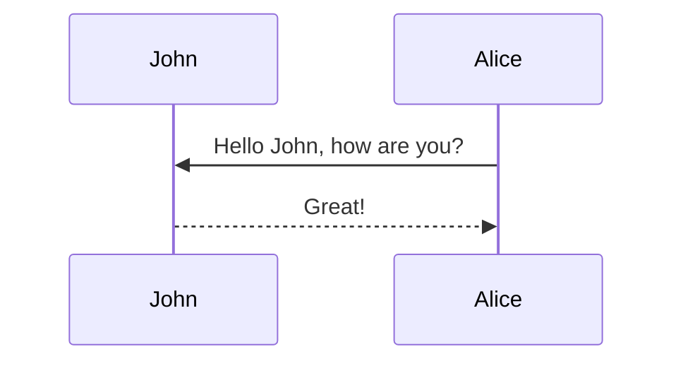

# Using NgRx Store with LocalStorage in a Standalone Angular App

In this tutorial, we'll build a simple Angular application using the **Standalone Component API** and manage state using **NgRx Store**. We'll also persist that state using **localStorage** via the `ngrx-store-localstorage` package.

> This guide is suitable for Angular 16+ and NgRx 16+.

---

## 🧱 Overview

- **State slice**: `bookings`
- **NgRx Store**: to manage state.
- **localStorage**: to persist state across sessions.
- **Standalone Angular app**: no `AppModule`, using `bootstrapApplication()` in `main.ts`.

---

## 🧰 Prerequisites

- Angular CLI installed
- NgRx Store: `@ngrx/store`
- Local storage sync: `ngrx-store-localstorage`

```bash
npm install @ngrx/store ngrx-store-localstorage
```

---

## Mermaid

The diagram below was generated by the following code:

````markdown

````


## 1. 📁 Define Your Booking Model

```ts
// src/app/models/booking.ts

export interface Booking {
  id: number;
  name: string;
  date: string;
}
```

---

## 2. 🎬 Create Booking Actions

```ts
// src/app/store/bookings/booking.actions.ts

import { createAction, props } from '@ngrx/store';
import { Booking } from '../../models/booking';

export const addBooking = createAction('[Booking] Add Booking', props<{ booking: Booking }>());
export const removeBooking = createAction('[Booking] Remove Booking', props<{ id: number }>());
export const clearBookings = createAction('[Booking] Clear All');
```

---

## 3. 🧠 Create Booking Reducer

```ts
// src/app/store/bookings/booking.reducer.ts

import { createReducer, on } from '@ngrx/store';
import { addBooking, removeBooking, clearBookings } from './booking.actions';
import { Booking } from '../../models/booking';

export const initialState: Booking[] = [];

export const bookingReducer = createReducer(
  initialState,
  on(addBooking, (state, { booking }) => [...state, booking]),
  on(removeBooking, (state, { id }) => state.filter(b => b.id !== id)),
  on(clearBookings, () => [])
);
```

---

## 4. 💾 Create Local Storage Meta-Reducer

```ts
// src/app/store/localStorageSync.reducer.ts

import { ActionReducer, INIT, UPDATE } from '@ngrx/store';
import { localStorageSync } from 'ngrx-store-localstorage';

export function localStorageSyncReducer(reducer: ActionReducer<any>): ActionReducer<any> {
  return localStorageSync({
    keys: ['bookings'],
    rehydrate: true,
  })(reducer);
}
```

---

## 5. 🚀 Bootstrap Application with Store

```ts
// src/main.ts

import { bootstrapApplication } from '@angular/platform-browser';
import { AppComponent } from './app/app.component';
import { appConfig } from './app/app.config';
import { provideStore } from '@ngrx/store';
import { bookingReducer } from './app/store/bookings/booking.reducer';
import { localStorageSyncReducer } from './app/store/localStorageSync.reducer';
import { MetaReducer } from '@ngrx/store';

const metaReducers: MetaReducer[] = [localStorageSyncReducer];

bootstrapApplication(AppComponent, {
  ...appConfig,
  providers: [
    ...appConfig.providers,
    provideStore({ bookings: bookingReducer }, { metaReducers }),
  ]
}).catch(err => console.error(err));
```

---

## ✅ Usage in Components

```ts
// Inject and use the store in your standalone component
import { Component } from '@angular/core';
import { Store } from '@ngrx/store';
import { addBooking } from './store/bookings/booking.actions';

@Component({
  selector: 'app-booking-button',
  standalone: true,
  template: `<button (click)="addSampleBooking()">Add Booking</button>`
})
export class BookingButtonComponent {
  constructor(private store: Store) {}

  addSampleBooking() {
    this.store.dispatch(addBooking({
      booking: {
        id: Date.now(),
        name: 'Sample Booking',
        date: new Date().toISOString()
      }
    }));
  }
}
```

---

## 📦 Final Notes

- State persists in `localStorage` under the key `bookings`.
- Clearing the browser's storage will reset state.
- This setup is perfect for small apps and prototypes.

> 🔐 Remember: `localStorage` is not secure. Avoid storing sensitive data.

---

## 📝 Summary

- ✅ Setup NgRx store in standalone mode
- ✅ Created `bookings` state with actions + reducer
- ✅ Used `ngrx-store-localstorage` to persist state

This setup can be extended to manage more slices of state (e.g., `users`, `auth`, etc.) by adding to the `keys` array in the meta-reducer.

---

Let me know if you'd like this exported as a Markdown file or deployed to your Jekyll blog!

