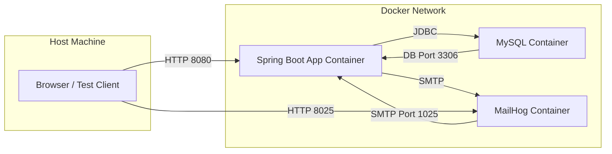

## 🐳 Building out a Docker Container for Spring Boot MailHog and Database 

### Introduction

New to DevOps? Need a simple walk through on how to set up a containerized app to run automated testing and deployment. This will get you started quickly. 
This article assumes docker is installed. Please follow DigitalOcean walk through to set up docker.

### Repository Structure 
The repo is intentially small:
```text
dockr-mail-db-shell/
├── docker-compose.yml
├── Dockerfile
├── .env.example
├── .github/
│   └── workflows/
│       └── ci.yml
└── README.md

```
Each file has a single responsibility. 

### Docker Flowchart
A clean docker setup looks like this:

### Explanation:
#### App Container

- Connects to MySQL via JDBC on hostname mysql:3306.
- Connects to MailHog via SMTP on hostname mailhog:1025.
- MySQL Container
- Exposes port 3306 (mapped to host if needed).
- Has a healthcheck so app waits until it’s ready.
- MailHog Container
- Exposes SMTP (1025) and web UI (8025).
- No strict healthcheck in CI (to avoid “unhealthy” failures).
- Host Machine / CI Runner
- Can access app on localhost:8080.
- Can access MailHog UI on localhost:8025.

---

#### Docker Compose: Wiring the Services Together

The heart of the setup is docker-compose.yml.

Services Defined
- app
  - Spring Boot application
  - Runs tests on startup
  - Depends on MySQL and MailHog
- mysql
  - Standard MySQL image
  - Initialized with test credentials
  - Healthcheck ensures readiness
- mailhog
  - Captures outbound email
  - Provides SMTP + Web UI


--- 

#### Why Service Names Matter

Inside Docker, containers communicate by service name, not localhost.

Service	| Hostname Used by App
MySQL	| mysql
MailHog	| mailhog

This allows the exact same config to work:
- Locally
- In GitHub Actions
- In any CI runner

---

#### Spring Boot Configuration (No Special CI Code)

Spring Boot is configured entirely via environment variables.

Database
```
spring.datasource.url=jdbc:mysql://mysql:3306/app_db
spring.datasource.username=${DB_USER}
spring.datasource.password=${DB_PASSWORD}

```

Mail

```
spring.mail.host=mailhog
spring.mail.port=1025
spring.mail.username=
spring.mail.password=
spring.mail.properties.mail.smtp.auth=false
spring.mail.properties.mail.smtp.starttls.enable=false

```
No mocks.
No profiles just for CI.
No special test-only wiring.

If the app can’t connect, the build fails immediately.

---


### Why MailHog Is the Secret Weapon

Mail testing is usually skipped in CI because it’s “hard”.

MailHog makes it trivial:
- No credentials
- No real emails sent
- App behaves exactly like production
- Messages are inspectable via HTTP
You can even add assertions later by hitting:

http://mailhog:8025/api/v2/messages


This lets you test:

Email sent
Subject/body correctness
Template rendering

All without touching SMTP infrastructure.

--- 

### Environment Variables & Secrets
#### Local Development

Developers copy:
```
cp .env.example .env
```

Then run:
```
docker compose up --build
```
#### GitHub Actions

GitHub Actions injects the same values using repository secrets:

    - DB_USER
    - DB_PASSWORD
    - Any app-specific keys (JWT, encryption keys, etc.)

The app never knows where the values came from.

--- 

### GitHub Actions Workflow: What Happens on Every Push

The CI workflow does exactly what you’d do locally.

High-Level Flow:

1. Checkout code

2. Build Docker images

3. Start containers

4. Wait for MySQL

5. Run Spring Boot tests

6. Tear everything down

This is important:

    - CI does not run Gradle/Maven directly.
    - Docker runs everything.

That guarantees parity.


---


### Why This Pattern Scales Across Projects

Once this shell exists, adding it to a new project is trivial:

- Copy docker-compose.yml
- Copy workflow file
- Adjust:

  - DB name

  - Ports (if needed)

  - App image name

Now every project gets:

- Email testing

- DB validation

- Startup confidence

- CI reliability

---

### Common Pitfalls This Setup Avoids

- ❌ localhost inside containers
- ❌ Mocked email that never reflects reality
- ❌ CI-only bugs
- ❌ “Works on my machine” DB issues
- ❌ Silent startup failures

If the app boots here, it boots anywhere.

### Final Thoughts

This setup isn’t fancy — and that’s the point.

It creates a boring, repeatable, trustworthy baseline that every Spring Boot app can rely on.

Once infrastructure stops being a question, you can focus on:

 - Features
 - Tests
 - Performance
 - Deployment

And that’s exactly what CI should enable.
