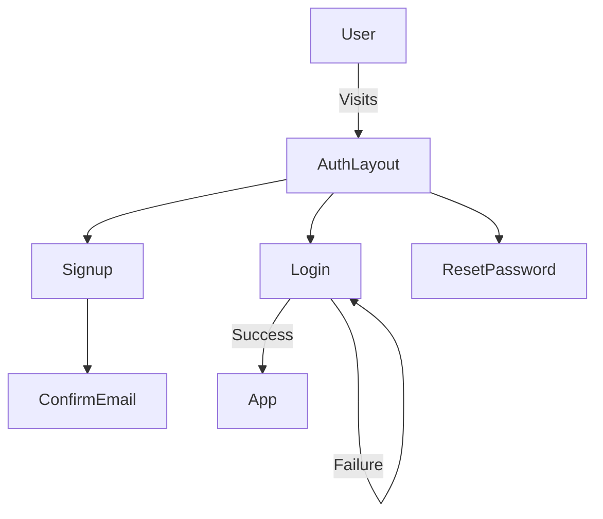

## A Complete Authentication Tutorial Part 1


### Introduction
Every developer needs drop in ready authentication system from UI to backends. Lets run that file cycle together. This tutorial is intended for those who need to learn react and need a strong drop in ready feature for React. In this series we will build different levels of the application full cycle from the front end cycle that easily ties into any api systems and scalability. 

#### Reusable Authentication Feature (React)
Designed and implemented a portable login feature using React, hooks, context, and RTL tests. Documented architecture and tradeoffs in a multi-part technical blog series.

---

### 🔧 Topics covered across the series

Feature-first React architecture
Tailwind layout & design system
Login / Signup / Email confirmation
Password reset flows
localStorage + session persistence
API abstraction & mocking
Unit + integration testing (RTL + Jest)

Real-world experience, not a tutorial toy.
- Sign in - user management
- Sign up -- user management
- Confirmation emailer page 
- Reset Password
- Testing framework
- Hosted as a subdomain (e.g., `auth.crystalhansenartographic.com`)

---

### 🧱 Tech Stack

- React 19+
- Tailwind 
- Login / Signup/ Email Confirmation 
- Authentication Context
- Password rest flows
- LocalStorage  + session  persistence
- Unit and Integration Testing (RTL + Jest)

---


### 🔄 Authentication Flow (High Level)
This section models the pages and ui we will implement for the shell of this feature. 




##### All authentication screens share:
- A consistent layout
- Header / footer
- Theme handling
- Centralized routing

This is achieved using React Router layout routes and <Outlet />.


### App Creation 

The instructions assume the user has the development environment set up for the react terminal code structure. Assume the terminal opens at user foldoer, and has a root directory called react-apps.
To start navigate to your prefered developer folder if different than the suggested route.
Follow this tutorial to create your app if you wish to understand it more: [ Getting Started with React ]()


#### 🛠 Project Setup
1. Create the Vite App
```bash
  npm create vite@latest
```

Choose the following options:

- Project name: login-feature
- Framework: React
- Variant: JavaScript + React Compiler
- Use rolldown-vite: No
- Install dependencies: Yes

```text
> npx
> create-vite

│
◇  Project name:
│  login-feature
│
◇  Select a framework:
│  React
│
◇  Select a variant:
│  JavaScript + React Compiler
│
◇  Use rolldown-vite (Experimental)?:
│  No
│
◇  Install with npm and start now?
│  Yes
```

{: .note }
⚠️ Node engine warnings and errors during Vite setup are expected if you’re running default is on Node 18. This does not block development for this series, however if you have `nvm` installed you can easily run `nvm use 22` or whatever higher node version you have and the warning will no longer show. Follow this post for installing
 [ Setting up NVM  ]() so you can easily switch node environments.


Then run:

```bash

  npm run dev

```


You should now see the default Vite + React page running locally confirming install was successful.


#####  Install Dependencies
Core Libraries
```bash
npm install react-router-dom
npm install lucide-react
npm install framer-motion
```

What these dependencies do:
react-router-dom → routing & layout composition
lucide-react → clean, modern icons
framer-motion → subtle UI animation

Tailwind CSS Setup for easy implementation of UI presets.
```bash
npm install -D tailwindcss postcss autoprefixer
npx tailwindcss init -p
```
{: .note}
If installation fails there could be an issue with the installer needing the most stable. At the time of this creation the tailwind required for 19/node22 requires 3.4 
```bash
npm install -D tailwindcss@3.4.17 postcss autoprefixer
```
and install without npx :
```bash
./node_modules/.bin/tailwindcss init -p
```


This generates:

- tailwind.config.js
- postcss.config.js

Update tailwind.config.js:

```
export default {
  content: [
    "./index.html",
    "./src/**/*.{js,jsx}"
  ],
  theme: {
    extend: {},
  },
  plugins: [],
};
```

{: .note }
Notice the content array. this is necessary to get tailwind included. 

Update src/index.css:
```css 
@tailwind base;
@tailwind components;
@tailwind utilities;
```

Restart the dev server:
```bash
npm run dev
```
We should see a screen of vite and react runing on the localhost similar to:

  http://localhost:5174/

---
#### React Default Architecture

To prepare this app to be a feature dropin we separate the folder system of the app. The architecture should separate the app from features therefore lets move the app.jsx into its own separate folder `/app/App.jsx` before we proceed and then run the server to ensure its still working. We need to move pointers in `main.jsx` to reflect our structure change. ei.)

 ```jsx
 import App from './app/App.jsx'
```
The architecture should look like the below structure before moving on. 

```text
src/
  ├─ app/
  │   ├─ App.jsx
  │   └─ Router.jsx
  │
  └─ main.jsx
```
One more thing that needs to be created is the `Router.jsx` file. Just leave it blank for now. 


Next Post  [ Login Feature Routing  ]() will cover  setting up the application page routing using the Router.jsx file configuration. This will identify the feature's file structure and implement the Routing for this [ Drop in Feature  ](https://github.com/cryshansen/login-feature-react) -- review the post 1 branch to see a snapshot of the code pushed to main. We will build out our UI using existing Tailwind registration layouts and header/footer and tailwind menus for this demo. This allows developers to reuse this feature for all react applications. It adds additional value by setting up a testing framework to ensure the code is functional. 
