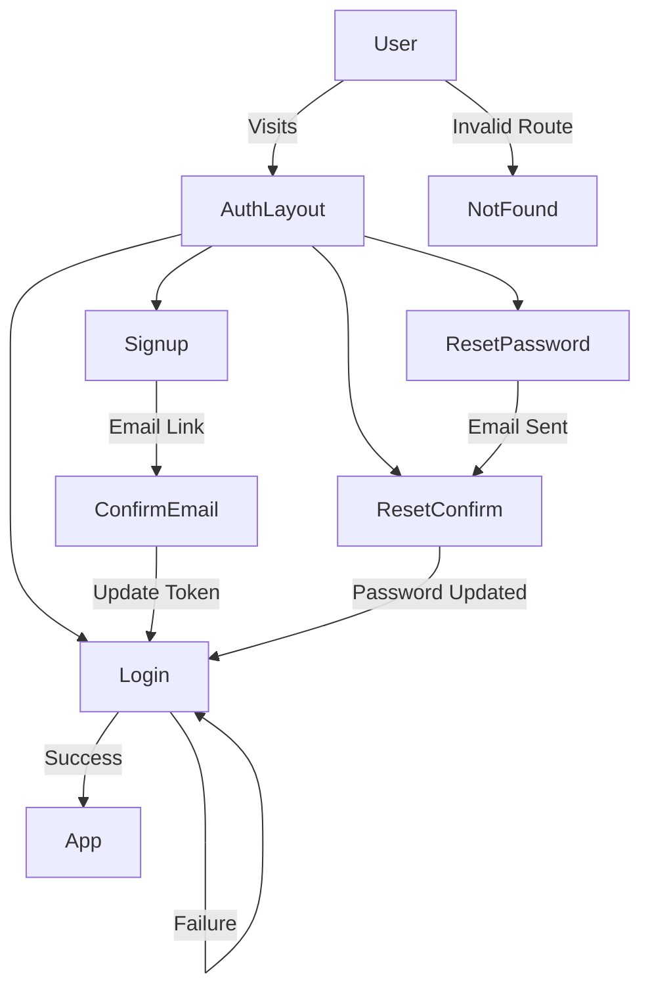

## Post 2: Continuation of Building the UI

This post and [previous]() post covers the separation of the UI password meter. Our Feature Series, where we build the general Authentication UI of our drop in feature. In this part we complete the remaining feature pages and components.

→ Series overview: /blog/react-login/

Grab the branch [Post Password Strength UI](https://github.com/cryshansen/login-feature-react/tree/post/2c-password-strength-meter).

---

### The Architecture of the final UI Version of Our Series

Lets take a look at what we should have for files within the last checked in code structure. We indicate which files we will be refactoring in this poast.

```text
src/
  ├─ app/
  │   ├─ App.jsx
  │   └─ Router.jsx

  └─ features/
      └─ auth/
        ├─ components/
        |    ├─ elements/
        |    |  ├─ AccountDropdown.jsx  
        |    |  └─ AuthBackground.jsx 
        |    |  └─ DarkModeButton.jsx 
        |    ├─ forms/
        |    |  ├─ ConfirmEmail.jsx      <- see below post   
        |    |  ├─ ConfirmPasswordFields.jsx   
        |    |  ├─ ConfirmResetForm.jsx    <- see below post         
        |    |  ├─ LoginForm.jsx 
        |    |  ├─ PasswordField.jsx
        |    |  ├─ PasswordRules.jsx 
        |    |  ├─ PasswordStrengthMeter.jsx   
        |    |  ├─ RequestResetForm.jsx   <- see below post 
        |    |  └─ SignupForm.jsx                       
        |    ├─ layout/
        |      ├─ AuthLayout.jsx
        |      ├─ AuthFacingHeader.jsx
        |      ├─ HeaderTopLevel.jsx        
        |      └─ AuthFacingFooter.jsx
        |    ├─ utils/
        |      ├─ passwordRules.jsx 
        |      └─ passwordStrength.jsx         
        ├─ pages/
        │  ├─ ConfirmEmailPage.jsx    <- adjust by below post 
        │  ├─ ConfirmResetPage.jsx    <- adjust  by below post         
        │  ├─ LoginPage.jsx   
        │  ├─ NotFoundPage.jsx    <- adjust  by below post
        │  ├─ ProfilePage.jsx     <- adjust by below post
        │  ├─ RequestResetPage.jsx    <- adjust by below post       
        │  └─ SignupPage.jsx
  └─ main.jsx
```


These are the changes and additions we need to implement the Login Feature UI.  All we are hoping for at this stage is the layout to render the page, form and fields. There should be little to no coding at this point as we are working on setting up the design front end UI. If needed refer to the github repository [Password Strength Meter](https://github.com/cryshansen/login-feature-react/tree/post/2c-password-strength-meter) branch connected to the previous post to review the structure and finalize these pages. 

--- 

#### Adjusting Page Files 

1. Confirmation Email Page `ConfirmEmailPage.jsx`    
2. Request Reset Page `RequestResetPage.jsx` 
3. Confirm Reset Page  `ConfirmResetPage.jsx`        
4. Profile Page   `ProfilePage.jsx`     
5. Not Found Page `NotFoundPage.jsx`     

--- 

##### 1. Confirmation Email Page -> after signup -> email sent with link

The `ConfirmationEmailPage.jsx` handles the validation of the email on signup. This page will capture url parameters to confirm within our system. This is a standard architectural component. Lets open it and copy code:

Head over to [ Tailwind UI] (https://tailwindcss.com/plus/ui-blocks/marketing/feedback/404-pages) for a quick styled 404 / Not Found page to structure our response to our parameter link.  
Copy the  `code` toggle, dark mode and `React` dropdown.
 choosing v3.4 in the `code` area dropdown  

Or, copy the code below:

```jsx
//ConfirmationEmailPage.jsx
import { useEffect, useState } from "react";
import { useSearchParams, Link } from "react-router-dom";

import AuthBackground from "../components/elements/AuthBackground";

export default function ConfirmEmailPage({darkMode}) {
  

  return (

      <AuthBackground darkMode={darkMode} >
       <div className="sm:mx-auto sm:w-full sm:max-w-sm">
          
       </div>
        <div className="text-center">
          <p className="text-base font-semibold text-indigo-400">OK!</p>
          <h1 className="mt-4 text-balance text-5xl font-semibold tracking-tight text-white sm:text-7xl">
            Your Email is Confirmed.
          </h1>
         
          <p className="text-gray-600">Confirming your email…</p>
         
          <p className="mt-6 text-pretty text-lg font-medium text-gray-400 sm:text-xl/8">
              Your account is now active. You can log in.
          </p>
          <div className="mt-10 flex items-center justify-center gap-x-6">
            <Link
              to="/login"
              className="rounded-md bg-indigo-500 px-3.5 py-2.5 text-sm font-semibold text-white shadow-sm hover:bg-indigo-400 focus-visible:outline focus-visible:outline-2 focus-visible:outline-offset-2 focus-visible:outline-indigo-500"
            >
              Go back home
            </Link>
            <Link to="#" className="text-sm font-semibold text-white">
              Contact support <span aria-hidden="true">&rarr;</span>
            </Link>
          </div>
        </div>
      </AuthBackground>

  );
}
```
The HTML / React syntax above shows two messages: "Confriming your email..." is intended as part of a spinner while the intended url parameters will be assest then the message "Your account is now active...."  These elements will be refactored during our Part 3 post Managing State and Side Effects [post]() 

---

##### 2. Request Reset Page  -> forgot password link -> email sent with link

This Page function is to handle the user requesting a reset of their password and involves an email input to send a reset link for the user to reset their password. This drives the workflow towards the 

```jsx
//RequestResetPage.jsx

import React, { useState } from "react";
import { Link, useNavigate } from "react-router-dom";
import AuthBackground from "../components/elements/AuthBackground";
import RequestResetForm from "../components/forms/RequestResetForm";

export default function RequestResetPage({ darkMode }) {
  darkMode = true; // temp for testing

  return (
    <AuthBackground darkMode={darkMode}>
      <div className="sm:mx-auto sm:w-full sm:max-w-sm">
          
          <h2 className="mt-10 text-center text-2xl/9 font-bold tracking-tight text-white">Reset your Password</h2>
       </div>
      
      <div
        className={`p-8 rounded shadow-sm backdrop-blur-md border mt-10 sm:mx-auto sm:w-full sm:max-w-sm border border-white/10 rounded-lg p-8 
        ${darkMode
          ? "bg-slate-900/60 "
          : "bg-gray-50 bg-gray-800 border-slate-200/70"
        }`}
      >
        <RequestResetForm darkMode={darkMode} />
      </div>
    </AuthBackground>
  );
}

```

We include the <RequestResetForm> above which extracts the fields which will render a form within this components fields. This separates the layout from the form functions. Further the Form reuses the email field we abstracted in an earlier step. 

```jsx
///RequestResetForm
import React from "react";

import EmailField from "./EmailField";

export default function RequestResetForm({ darkMode }) {

const handleSubmit = async (e) => {
    e.preventDefault();
   
  };
    return (
        <form className="space-y-6" onSubmit={ handleSubmit }>
            <EmailField darkMode={darkMode} />
            <button 
            className="flex w-full justify-center rounded-md bg-indigo-600 px-3 py-1.5 text-sm/6 font-semibold text-white shadow-sm 
              hover:bg-indigo-500 focus-visible:outline focus-visible:outline-2 focus-visible:outline-offset-2 focus-visible:outline-indigo-600 "
            >
              Send Reset Link
            </button>
        </form>
    );
}
```
The reset page is complete and abstraction of components allows us to build faster and focus on field specific requirements. 

---

##### 3. Confirm Reset Page 

Next we deal with the `ConfirmResetPage.jsx` and the form component creatd for this page. there are three parts to this


Copy this code:

```jsx
//ConfirmResetPage.jsx
import React, { useState, useEffect } from "react";
import { useSearchParams, Link, useNavigate } from "react-router-dom";

import AuthBackground from "../components/elements/AuthBackground";
import ConfirmResetForm from "../components/forms/ConfirmResetForm";

export default function ConfirmResetPage({ darkMode }) {
  return(
  
    <AuthBackground darkMode={darkMode}>
     <div className="sm:mx-auto sm:w-full sm:max-w-sm">
          
          <h1 className="text-2xl font-semibold text-center mb-6">
            Set new password
        </h1>
       </div>
       
      <div
        className={`p-8 rounded-lg shadow-sm backdrop-blur-md border bg-gray-800
        ${darkMode
          ? "bg-slate-900/60 border-white/10"
          : "bg-white/70 bg-gray-800 border-slate-200/70"
        }`}
      > 
        <ConfirmResetForm darkMode={darkMode} />
      </div>
    </AuthBackground>
  );
}

```

---

###### 3a Confirm Request Form 

```jsx
//ConfirmResetForm

import React, { useState, useEffect } from "react";
import { useSearchParams } from "react-router-dom";
import ConfirmPasswordFields from "./ConfirmPasswordFields";
import PasswordInput from "./PasswordField";

export default function ConfirmResetForm({ darkMode }) {

  const [searchParams] = useSearchParams();
  const token = searchParams.get("token"); //see routing for structure token=
  const email =  searchParams.get("email"); //see routing email=

  const [password, setPassword] = useState("");
  const [confirm, setConfirm] = useState("");
  const [currentPassword, setCurrentPassword] = useState("");

  const passwordsMatch = password === confirm && password.length > 0;


  const handleSubmit = async (e) => {
    //console.log(email + " " + pw + " " +  confirm  + " " + token);
      e.preventDefault();
      
  };


  return (

        <form className="space-y-5" onSubmit={handleSubmit}>
          {/* Current password */}
            <PasswordInput
              label="Current Password"
              value={currentPassword}
              onChange={setCurrentPassword}
              autoComplete="current-password"
            />

            {/* New password */}
            <ConfirmPasswordFields darkMode={darkMode}
                    password={password}
                    setPassword={setPassword}
                    confirm={confirm}
                    setConfirm={setConfirm}
                    showConfirm={true}
                  />

            <button
              type="submit"
              disabled={!passwordsMatch}
              className={`
                w-full py-3 rounded-xl font-semibold transition
                ${
                  passwordsMatch
                    ? "bg-indigo-600 hover:bg-indigo-700 text-white"
                    : "bg-gray-300 text-gray-500 cursor-not-allowed"
                }
              `}
            >
              Update Password
            </button>
        </form>
  );
}


```


This keeps responsibilities clear:

- PasswordField handles authentication
- ConfirmPasswordFields handles password creation

---

##### 3b. Reset Password flow: Architecture choice Mixing Both Password Components

Reset flows are special.

A proper reset/change password screen includes:

1. Current password (or token-based auth)
2. New password
3. Confirm new password

The solution was composition, not reuse-by-force.
```jsx
<PasswordField
  label="Current Password"
  value={currentPassword}
  onChange={setCurrentPassword}
  autoComplete="current-password"
/>

<ConfirmPasswordFields
  password={newPassword}
  setPassword={setNewPassword}
  confirm={confirmPassword}
  setConfirm={setConfirmPassword}
  showConfirm
/>
```

---

##### 4. Profile Page   

This page takes similar fields from the abastracted fields in past post which illustrates how easy it is to implement a small components into forms and pages. Open the `Profile.jsx` and Copy the code below

```jsx
import { useState } from "react";
import { useNavigate } from "react-router-dom";

import AuthBackground from "../components/elements/AuthBackground";
import FirstLastNameFields from "../components/forms/FirstLastNameFields";
import EmailField from "../components/forms/EmailField";

export default function ProfilePage({ darkMode }) {
  darkMode = true; // temp for testing
   const user = { firstname:"Bob",lastName:"Smith", email:"test@test.com", password:'' }
   
   const handleEmailChange = async () => {

   };
   const handlePasswordReset = async () => {
   };
   const handleProfileSave = async () => {
   };

   return (
       <AuthBackground darkMode={darkMode}>
        <div className="sm:mx-auto sm:w-full sm:max-w-sm">
          
          <h2 className="mt-10 text-center text-2xl/9 font-bold tracking-tight text-white pb-4">Profile</h2>
       </div>

          <div className={`max-w-xl space-y-8 p-6 rounded-lg shadow-sm backdrop-blur-md border bg-slate-900 border-white/20`}>
      
            {/* Name Section */}
            <section className="space-y-4 ">
             <FirstLastNameFields darkMode={darkMode} />
      
              <button
                onClick={handleProfileSave}
                className="px-4 py-2 bg-indigo-600 text-white rounded"
              >
                Save name
              </button>
            </section>
      
            {/* Email Section */}
            <section className="space-y-4">
              <h2 className="text-lg font-medium">Email</h2>
      
              <p className="text-sm text-gray-600">
                Current email: <strong>{user.email}</strong>
              </p>
                 {/* <input
                    type="email"
                    className="block w-full rounded-md bg-white/5 px-3 py-1.5 text-base text-white outline outline-1 -outline-offset-1 outline-white/10 placeholder:text-gray-500 focus:outline focus:outline-2 focus:-outline-offset-2 focus:outline-indigo-500 sm:text-sm/6"
                    value={newEmail}
                    autoComplete="on"
                     onChange={(e) => setNewEmail(e.target.value)}
                  /> */}
               <EmailField darkMode={darkMode} />
              <button
                onClick={handleEmailChange}
                  className={`px-4 py-2 border rounded border-indigo-600 text-indigo-600 hover:bg-indigo-300
                   ${darkMode
                    ? "bg-slate-800"
                    : "bg-white"
                  }   
                  `}
              >
                Request email change
              </button>
            </section>
      
            {/* Password Section */}
            <section className="space-y-2">
              <h2 className="text-lg font-medium">Password</h2>
              <button
                onClick={handlePasswordReset}
                className={`text-sm text-indigo-600 hover:underline
                   ${darkMode
                    ? "bg-slate-800"
                    : "bg-white"
                  }   
                  `}
              >
                Send password reset link
              </button>
            </section>
          </div>
      </AuthBackground>
   );
}

```
Note the three separate components reused in this file. We created a component for firstname / lastname used in this file and the signup file. 

We created the email component to share it accross the forms requiring it. this allows us to itemize the validations of email. 

---

##### 5. Not Found Page

Head over to [ Tailwind UI](https://tailwindcss.com/plus/ui-blocks/marketing/feedback/404-pages) for a fully  styled 404 / Not Found page to UI structure.  
Copy the  `code` toggle, dark mode and `React` dropdown.
 choosing v3.4 in the `code` area dropdown  

Or, copy the code below which has already changed a tags to Link syntax:

Open the `NotFoundPage.jsx` page and paste the code within the return directly. 

```jsx

import { useEffect, useState } from "react";
import { useSearchParams, Link } from "react-router-dom";

import AuthBackground from "../components/elements/AuthBackground";

export default function NotFoundPage({ darkMode }) {

    return (
        <AuthBackground darkMode={darkMode}>
           <div className="sm:mx-auto sm:w-full sm:max-w-sm">
          
       </div>
        <div className="text-center">
          <p className="text-base font-semibold text-indigo-400">404</p>
          <h1 className="mt-4 text-balance text-5xl font-semibold tracking-tight text-white sm:text-7xl">
            Page not found
          </h1>
          <p className="mt-6 text-pretty text-lg font-medium text-gray-400 sm:text-xl/8">
            Sorry, we couldn’t find the page you’re looking for.
          </p>
          <div className="mt-10 flex items-center justify-center gap-x-6">
            <Link
              to="/login"
              className="rounded-md bg-indigo-500 px-3.5 py-2.5 text-sm font-semibold text-white shadow-sm hover:bg-indigo-400 focus-visible:outline focus-visible:outline-2 focus-visible:outline-offset-2 focus-visible:outline-indigo-500"
            >
              Go back home
            </Link>
            <Link to="#" className="text-sm font-semibold text-white">
              Contact support <span aria-hidden="true">&rarr;</span>
            </Link>
          </div>
        </div>
      </AuthBackground>
    );
}

```

---

#### The App Routing flow of our feature pages 
We can visualize what we have just built with the pages and forms of our feature. This flow diagram represents the intent-driven navigation of the authentication system. Rather than treating auth as isolated pages, all entry points are modeled as part of a unified user journey gated by a shared layout.



This workflod diagram illustrates the pages and functions. It will help use next when we discuss managing state & side effects and session states, API posts.

---

#### Bonus - Add OAuth UI 

Adding OAuth Buttons within both the `LoginPage.jsx` and `SignupPage.jsx` that can be enabled with OAuth processes. For the time being, we are dropping in the buttons for a future managed handling of the OAuth app flow.

```jsx

export default function OAuthButtons({ darkMode }) {

    return (
        <>   
            <div className="relative my-8">
                <div className="absolute inset-0 flex items-center">
                    <div className="w-full border-t border-slate-300" />
                </div>
                <div className="relative flex justify-center text-sm">
                    <span className="bg-slate-900 px-3 text-slate-100">
                    or continue with
                    </span>
                </div>
            </div>
            <div className="flex space-x-6 mt-10 sm:mx-auto sm:w-full sm:max-w-sm justify-center gap-1">
            
                {/** grid-template-columns: repeat(2,minmax(0,1fr));*/}
                <button className="flex items-center gap-2 bg-slate-700 hover:bg-slate-700 text-white font-bold py-2 px-4 rounded">
                    <div className="w-5 h-5">
                        <svg viewBox="0 0 24 24" aria-hidden="true" className="aegn aegu">
                        <path d="M12.0003 4.75C13.7703 4.75 15.3553 5.36002 16.6053 6.54998L20.0303 3.125C17.9502 1.19 15.2353 0 12.0003 0C7.31028 0 3.25527 2.69 1.28027 6.60998L5.27028 9.70498C6.21525 6.86002 8.87028 4.75 12.0003 4.75Z" fill="#EA4335"></path>
                        <path d="M23.49 12.275C23.49 11.49 23.415 10.73 23.3 10H12V14.51H18.47C18.18 15.99 17.34 17.25 16.08 18.1L19.945 21.1C22.2 19.01 23.49 15.92 23.49 12.275Z" fill="#4285F4"></path>
                        <path d="M5.26498 14.2949C5.02498 13.5699 4.88501 12.7999 4.88501 11.9999C4.88501 11.1999 5.01998 10.4299 5.26498 9.7049L1.275 6.60986C0.46 8.22986 0 10.0599 0 11.9999C0 13.9399 0.46 15.7699 1.28 17.3899L5.26498 14.2949Z" fill="#FBBC05"></path>
                        <path d="M12.0004 24.0001C15.2404 24.0001 17.9654 22.935 19.9454 21.095L16.0804 18.095C15.0054 18.82 13.6204 19.245 12.0004 19.245C8.8704 19.245 6.21537 17.135 5.2654 14.29L1.27539 17.385C3.25539 21.31 7.3104 24.0001 12.0004 24.0001Z" fill="#34A853"></path>
                        </svg> 
                    </div>Google
                </button>
                <button className="flex items-center gap-2 bg-slate-700 hover:bg-slate-700 text-white font-bold py-2 px-4 rounded">
                    <div className="w-5 h-5">
                        <svg viewBox="0 0 20 20" fill="currentColor" aria-hidden="true" className="aegl aeib">
                            <path d="M10 0C4.477 0 0 4.484 0 10.017c0 4.425 2.865 8.18 6.839 9.504.5.092.682-.217.682-.483 0-.237-.008-.868-.013-1.703-2.782.605-3.369-1.343-3.369-1.343-.454-1.158-1.11-1.466-1.11-1.466-.908-.62.069-.608.069-.608 1.003.07 1.531 1.032 1.531 1.032.892 1.53 2.341 1.088 2.91.832.092-.647.35-1.088.636-1.338-2.22-.253-4.555-1.113-4.555-4.951 0-1.093.39-1.988 1.029-2.688-.103-.253-.446-1.272.098-2.65 0 0 .84-.27 2.75 1.026A9.564 9.564 0 0110 4.844c.85.004 1.705.115 2.504.337 1.909-1.296 2.747-1.027 2.747-1.027.546 1.379.203 2.398.1 2.651.64.7 1.028 1.595 1.028 2.688 0 3.848-2.339 4.695-4.566 4.942.359.31.678.921.678 1.856 0 1.338-.012 2.419-.012 2.747 0 .268.18.58.688.482A10.019 10.019 0 0020 10.017C20 4.484 15.522 0 10 0z" clipRule="evenodd" fillRule="evenodd"></path>
                        </svg> 
                    </div> Github
                </button> 
            </div>
        </>
    );
}

```

Open both pages above and import the component:

```jsx
import OAuthButtons from "../components/forms/OAuthButtons";

```

Within the return, area of Page our usage of <OAuthButtons darkMode={darkMode}>


```jsx 
<div className="mt-10 sm:mx-auto sm:w-full sm:max-w-sm border  border-white/10 rounded-lg p-8 bg-gray-900 backdrop-blur-sm">
    
    <SignupForm darkMode={darkMode} />
    <p className="mt-10 text-center text-sm/6 text-gray-400">
        Already a member?{' '}
        <Link to="/login" className="font-semibold text-indigo-400 hover:text-indigo-300">
            Login here.
        </Link>
    </p>

    <OAuthButtons darkMode={darkMode} />
              
</div>

```
---

#### Final Thoughts

This post is non-extensive and may be easier facilitated via the github [Post 2d UI OAuth ](https://github.com/cryshansen/login-feature-react/tree/post/2d-UI-OAuth-add) for UI since there are many pages and many items extracted from the tailwind UI into components that allow one place coding. The code focuses on layout and structure — not API calls, state management, or authentication logic.

The goal is to establish a reusable auth shell that all auth flows (login, signup, password reset, email confirmation) can share.


The next [Part 3 Managing State]() in the series focuses on the React Hooks, States and managing Loading, error, success states. Our code may already contain some of these components, due to copying from functional code, however we will cover these aspects of the react hook library theory and approach.