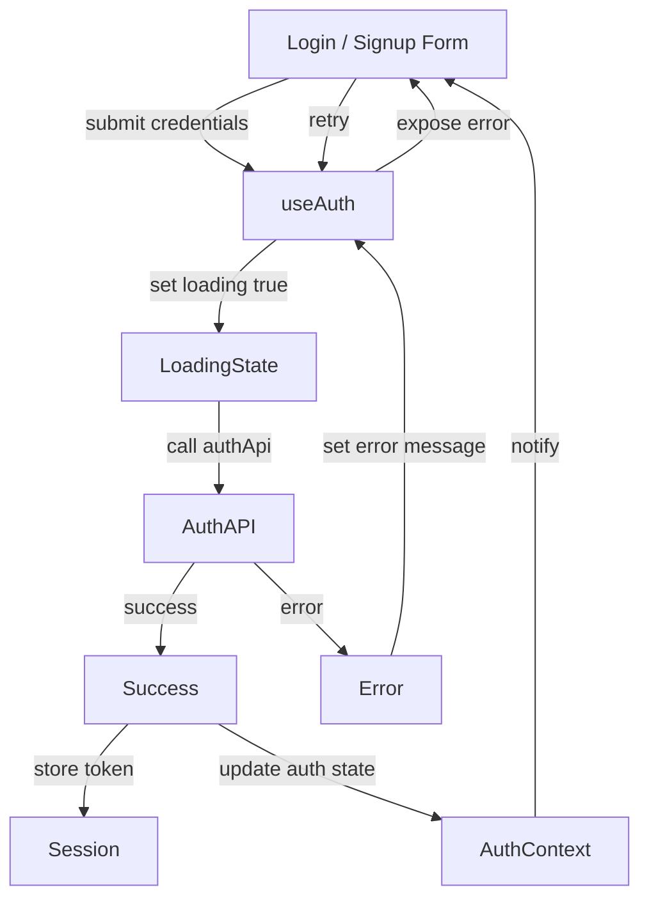
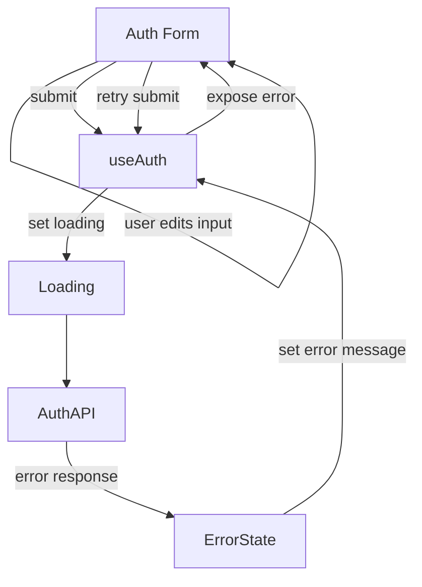
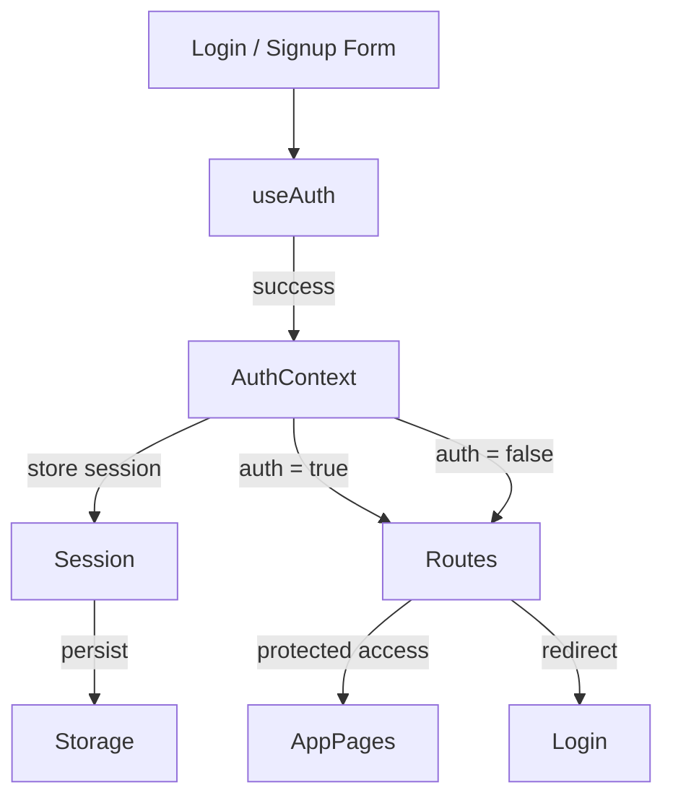

## Part 3: Managing State & Side Effects : useAuth Hook

By the time we reach this post, the UI is no longer the hard part. You can find our finalized UI [ Post 2d]()

The real challenge in authentication flows is application `state`, meaning:

- What is loading?
- What failed?
- What succeeded?
- What side effects should happen — and where?

In this post, we isolate that complexity into a single, reusable hook: `useAuth`. To follow along, pick up the git code [Post 2d UI OAuth ](https://github.com/cryshansen/login-feature-react/tree/post/2d-UI-OAuth-add) to continue to follow along. 

---

### Why a useAuth Hook Exists

Without a hook, login logic tends to leak everywhere:
- Components manage API calls
- Forms handle loading flags
- Error strings get passed through multiple layers
- Redirect logic lives in buttons

That approach scales poorly. Instead, we treat login as business logic, not a UI concern. The goal of useAuth is simple:
- One hook owns the login process end-to-end.


--- 

##### Where These Fit in the Series


1. Introduce useAuth responsibilities
2. Show State & Side Effects diagram
3. Show Failure + Retry Loop
4. Show Context → Routes Flow
5. Code

That order teaches thinking before typing.


--- 

### 1. Responsibilities of useAuth

The hook is responsible for:
- Initiating the login request
- Tracking async state
- Exposing a simple interface to the UI
- Reporting success or failure
- Remaining testable without rendering components

What it does not do:
- Render UI
- Know about layouts
- Handle routing directly
- Store long-term session state (that’s Post 5)

---

---

### 2. Show State & Side Effects diagram
What we are building with the useAuth and AuthContext will flow from form submission triggers to pass the functions necessary to authenticate. 




---

#### How This Diagram Maps to the Code 

##### useAuth is the control layer
- Owns async execution
- Owns loading + error state
- Talks to the API
- Reports outcomes upward

##### UI is intentionally dumb

- Submits credentials
- Reads isLoading
- Displays error
- Reacts to success indirectly

##### Side effects are explicit

- Token storage
- AuthContext updates
- Redirects happen after state resolution

---

#### Why This Matters 

UI components do not “log users in”. They ask useAuth to do it, then react to state.

This is the difference between:
- ❌ Form-driven auth
- ✅ State-driven auth

--- 

### State Model. 

- The login flow has only three meaningful states:
- Idle / Loading
- Success
- Error
Everything else is derived.

### A minimal state shape looks like this:

- isLoading
- error
- login() function

This keeps the API predictable and easy to reason about.

---

### Async Handling Without UI Coupling

The hook owns the async flow:
- Starts loading
- Calls the API
- Catches errors
- Resets state appropriately

From the component’s perspective:

- Call login
- Read isLoading
- Display error if present

The component never needs to know how login works — only what state it’s in. That separation is the entire point.


#### 3. Show Failure + Retry Loop -- useAuth Failer and Retry Loop 

The diagram below focusses our attention on what happens when logins go wrong and how retury is handled cleanly without page reloads.



##### Failure Does Not Break Flow

Every auth action follows the same pattern:

- Clear previous message
- Validate inputs
- Simulate or call API
- Update state
- Return control to UI

Example: resetPassword, signup, requestPasswordReset

They:

- Throw errors instead of handling UI
- Set messages instead of navigating
- Allow retries by design

This is why retry is “free” — the next call resets state naturally.

--- 

##### Key talking point here is;

- Errors do not break the flow
- State resets naturally on the next submit
- No conditionals inside the UI for API logic
- Restry is free because state is isolated. 

---

#### 4. Show Context → Routes Flow → Diagram 2 useAuth AuthContext and Routing
This one shows why context exists at all and how touting becomes a consumer , not a controller.



What this diagram communicates

- useAuth does not navigate
- AuthContext owns session truth
- Routes react to state, not events
- Redirects are declarative

This aligns perfectly within the AuthLayout.jsx file:

```jsx
{isAuthenticated ? <Outlet /> : <Navigate to="/login" />}

```

---

### Avoiding Prop Drilling

Without a hook:

- Loading flags get passed down
- Error messages bubble up
- Handlers get threaded through components

With useAuth:

- State lives in one place
- Components consume exactly what they need
- No intermediary components need awareness of auth logic

This is especially important once:

-Auth CTA components
- Modal variants
- Light/Dark layouts
- Mobile versions

…all need the same behavior.

---

### Hook Testing Strategy

Because the logic lives in a hook, we can test it without rendering the full UI.

Tests focus on:

- Initial state
- Loading transitions
- Success resolution
- Error handling
- API failure scenarios

This keeps tests:

- Fast
- Deterministic
- Free of layout noise

UI tests can then focus purely on presentation.

---


### What This Enables Later

By isolating login state early, we unlock:

- Easy swap of real vs mock APIs
- Shared logic across multiple login UIs
- Cleaner AuthContext integration
- Predictable error handling across the app
- Confident refactors

This is what makes the feature portable — not just functional.

---

### 5. AuthContext As State Owner  

We create a file 

```text
src/
├─ app/
│  ├─ App.jsx
│  └─ Router.jsx
│
├─ context/
│  └─ AuthContext.jsx <-- this file we manage the state hooks within. 
│
├─ features/
│  └─ auth/.../
...
│
└─ main.jsx


```

#### Integrating AuthContext into the Login Form

At this point in the series, our login form already looks complete.
It manages inputs, toggles password visibility, and handles submission.

What it does not do yet is authenticate.

That’s intentional.

The login form’s responsibility is collecting credentials, not deciding how login works.
That responsibility belongs to `useAuth`.

---

#### What Changes When We Introduce useAuth

Before integration, the form:

- Owns email/password state
- Handles submit
- Knows nothing about authentication success or failure

After integration, the form:

- Still owns email/password state
- Calls login() from useAuth
- Reacts to auth state, not API results
- Does not store tokens
- Does not manage session logic
- Does not navigate on success directly

This preserves the separation we designed earlier.

---

#### Step 1: Consume the Auth Context

We start by importing and consuming useAuth.

```jsx
import { useAuth } from "../../context/AuthContext";
```

Inside the component:

```jsx
const { login, authMessage, clearAuthMessage, isAuthenticated } = useAuth();
```

At this point, the form has access to:
- login() → triggers authentication
- authMessage → displays success / error info
- isAuthenticated → reacts to state change
- clearAuthMessage() → resets UI feedback

No API calls. No storage. No side effects.

---

#### Step 2: Delegate Submission to useAuth

The submit handler becomes intentionally thin.

**Before** 

The form would have handled API calls directly.

**After**

The form simply forwards credentials.
```jsx
const handleSubmit = async (e) => {
  e.preventDefault();
  clearAuthMessage();

  try {
    await login({ email, password });
  } catch (err) {
    // errors are already handled by auth state
    console.error(err);
  }
};
```

Important details here:

- The form does not interpret errors
- It does not set loading flags
- It does not navigate on success

It asks useAuth to log in — and waits.

---

#### Step 3: React to Auth State, Not Events

Navigation is a reaction, not an instruction.

We let React respond declaratively:

```jsx
useEffect(() => {
  if (isAuthenticated) {
    navigate("/dashboard");
  }
}, [isAuthenticated, navigate]);
```

 Why this matters:

- Login success may come from refresh
- Login may occur elsewhere
- Auth state is the source of truth

The form doesn’t care how authentication happened — only that it did.
This maps directly to the Context → Routes diagram from earlier.

---

#### Step 4: Display Auth Feedback (Without Logic)

Instead of conditionals tied to API responses, we render what the context provides.

```jsx
{authMessage && (
  <p
    className={`text-sm ${
      authMessage.type === "error"
        ? "text-red-400"
        : "text-green-400"
    }`}
  >
    {authMessage.text}
  </p>
)}
```

This is key:

- The form does not decide what message to show
- It does not know why the message exists
- It only renders state

That’s state-driven UI.

---

#### Final Login Form (Integrated)

Here’s the conceptually complete version of the login form after integration:

```jsx
//LoginForm.jsx
import React, { useEffect, useState } from "react";
import { Link, useNavigate } from "react-router-dom";
import { EyeIcon, EyeSlashIcon } from "@heroicons/react/24/outline";
import { useAuth } from "../../context/AuthContext";

export default function LoginForm({ darkMode }) {
  const navigate = useNavigate();
  const { login, authMessage, clearAuthMessage, isAuthenticated } = useAuth();

  const [email, setEmail] = useState("");
  const [password, setPassword] = useState("");
  const [showPassword, setShowPassword] = useState(false);

  useEffect(() => {
    if (isAuthenticated) {
      navigate("/dashboard");
    }
  }, [isAuthenticated, navigate]);

  const handleSubmit = async (e) => {
    e.preventDefault();
    clearAuthMessage();

    try {
      await login({ email, password });
    } catch (err) {
      // handled by auth state
    }
  };

  return (
    <form className="space-y-6" onSubmit={handleSubmit}>
      <div>
        <label className="block text-sm font-medium text-gray-100">
          Email address
        </label>
        <input
          type="email"
          required
          value={email}
          onChange={(e) => setEmail(e.target.value)}
          className="block w-full rounded-md bg-white/5 px-3 py-1.5 text-white"
        />
      </div>

      <div>
        <label className="block text-sm font-medium text-gray-100">
          Password
        </label>
        <div className="relative">
          <input
            type={showPassword ? "text" : "password"}
            value={password}
            onChange={(e) => setPassword(e.target.value)}
            className="block w-full rounded-md bg-white/5 px-3 py-1.5 pr-10 text-white"
          />
          <button
            type="button"
            onClick={() => setShowPassword((v) => !v)}
            className="absolute inset-y-0 right-0 pr-3 text-gray-400"
          >
            {showPassword ? (
              <EyeSlashIcon className="h-5 w-5" />
            ) : (
              <EyeIcon className="h-5 w-5" />
            )}
          </button>
        </div>
      </div>

      {authMessage && (
        <p className="text-sm text-indigo-400">{authMessage.text}</p>
      )}

      <button
        type="submit"
        className="w-full rounded-md bg-indigo-500 px-3 py-1.5 text-white"
      >
        Sign in
      </button>

      <div className="text-sm text-right">
        <Link to="/reset" className="text-indigo-400">
          Forgot password?
        </Link>
      </div>
    </form>
  );
}
```

---

###### Why useAuth Is Just a Thin Wrapper

End the code section by reinforcing where logic lives.

Why useAuth Stays Small
```jsx
export function useAuth() {
  const ctx = useContext(AuthContext);
  if (!ctx) {
    throw new Error("useAuth must be used inside AuthProvider");
  }
  return ctx;
}
```

`useAuth` is intentionally boring.

Its job is not to add logic — it simply:

- Enforces proper usage
- Exposes state and actions
- Keeps components decoupled from implementation details

This is what makes the system scalable.

---

```scss
AuthProvider
   ↓
AuthContext (state + side effects)
   ↓
useAuth (consumer hook)
   ↓
Pages & Forms (react to state)
   ↓
Routes (gate access declaratively)

```

##### Why This Integration Matters

After this change:

- The form is reusable
- Auth logic is centralized
- Side effects are isolated
- Navigation is declarative
- Tests become trivial

Most importantly:

  The form no longer “logs users in.”
  It participates in an authentication system.

---

Next, we can:

Repeat this pattern for `Signup`, `Reset`, `ConfirmReset` forms to handle these authentictions.
This will show how `Reset Password` stays consistent. We continue to integrate the forms we have with the useState and useAuth features. 


You can also review the rest of the page code at the Github branch [Post 3 State Hooks](https://github.com/cryshansen/login-feature-react/tree/post/post3-state-hooks)

--- 

#### Coming Next

In [Post 3a Guarding Routes]() , we’ll build the route guards that provide access to `<Outlet>`, within it we will talk about:

- Explains route guarding clearly
- Distinguishes layout vs guard
- Shows how to compose them
- Includes a route tree diagram
- Explains why AuthLayout lives inside the feature (drop-in design)
- Reflects everything we reasoned through in this chat

