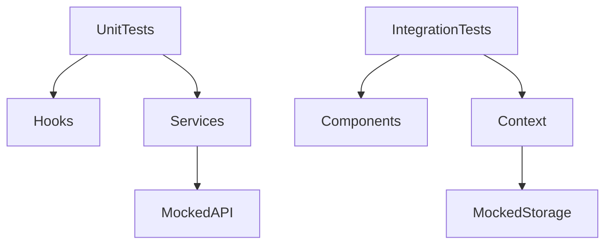
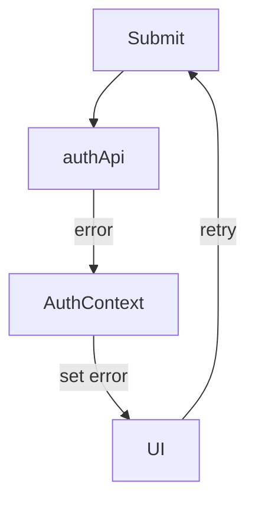
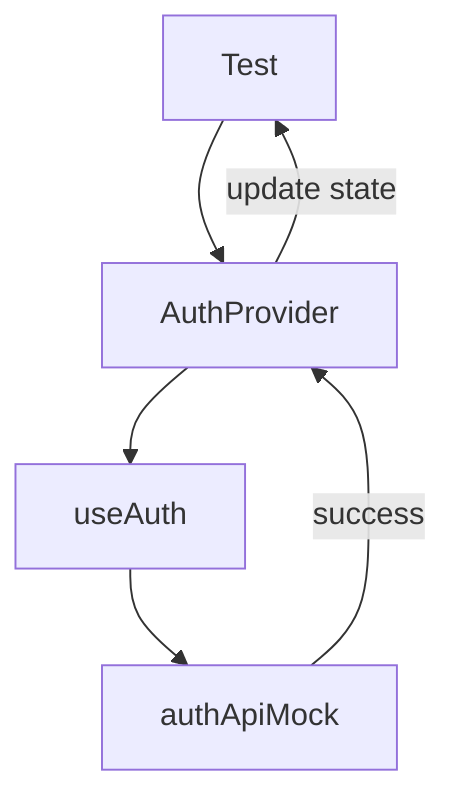

## Post 6: Testing the Login Feature (RTL + Jest)
“Tests don’t prove your code works. They prove you understand what matters.”


Everything we’ve built so far — hooks, services, context — was designed to make testing possible without pain. This post shows how those decisions pay off.

{: .note}

This post is under development and while it may be considered published it is under precise development to match any code checkin with the blog accuracy. Sorry for any inconvenience it will be updated very soon. Please consider the below a rough draft of the Testing system.


---

### What We’re Testing (and What We’re Not)

Before writing a single test, we define scope.

✅ We test:

- business logic
- auth state transitions
- success and failure paths
- user-visible behavior

❌ We don’t test:

- CSS classes
- animations
- implementation details
- third-party libraries

  If a test breaks when you rename a class — it’s a bad test.

--- 

### Testing Strategy Overview


| Layer	| Type |	Tool |
|------|--------------|--------|
| Hooks	| Unit tests	| Jest |
| API layer	| Unit tests |	Jest |
| Context	| Integration tests |	RTL |
| Forms	| Integration tests |	RTL |


---

### 🧪 Unit vs Integration Tests (Clear Boundaries)
##### Unit Tests

- isolated
- no DOM
- no routing
- no storage

###### Examples:

- useAuth
- authApi

##### Integration Tests

- real components
- mocked boundaries
- user behavior driven

###### Examples:

- login form flow
- error rendering
- redirect after login

---

### Diagram: Test Coverage Boundaries

---

### Mocking the Network (authApi)

We never hit a real backend in tests.
Instead:
- mock authApi
- control success/failure
- assert behavior

### Example
```js
jest.mock('../services/authApi', () => ({
  login: jest.fn(),
}));
```

This allows:
- deterministic tests
- fast execution
- no environment dependency

---

### Testing Failure States (Where Bugs Live)

Success paths are easy. Failures reveal architecture.

We explicitly test:

- invalid credentials
- network errors
- empty responses
- retry behavior

---

### Diagram: Failure & Retry Loop



```text
src/
├─ app/
│  ├─ App.jsx
│  └─ Router.jsx
│
├─ context/
│  └─ AuthContext.jsx
│
├─ features/
│  └─ auth/
│     ├─ components/
│     │  ├─ LoginForm.jsx
│     │  ├─ PasswordInput.jsx
│     │  ├─ AuthError.jsx
│     │  └─ AuthCTA.jsx
│     ├─ hooks/
│     │  └─ useLogin.js
│     ├─ services/
│     │  └─ authApi.js
│     ├─ validators/
│     │  └─ loginSchema.js
│     ├─ tests/
│     │  ├─ LoginForm.test.jsx
│     │  └─ useLogin.test.js
│     └─ index.js
│
└─ main.jsx

```
---

### Testing Context Behavior

AuthContext is tested through consumers, not directly.

We verify:
- session stored
- state updated
- logout clears state
- rehydration works

Rule

  If you test Context directly, you’re testing implementation — not behavior.

---

### Diagram: Context Integration Test Flow

---

### Asserting Auth Flows (End-to-End Without E2E)

We simulate:
- User types credentials
- Submits form
- API resolves
- Context updates
- UI redirects

All inside JSDOM — no browser automation required.

---

### Example: Login Success Flow (Conceptual)
```text
render LoginForm
→ fill inputs
→ click submit
→ expect loading
→ expect redirect
```

That’s it.
No sleep. No timers. No hacks.

--- 

### Avoiding Brittle UI Tests
##### Bad tests:

- checking class names
- snapshot testing entire pages
- asserting exact markup

##### Good tests:

- getByRole
- getByLabelText
- findByText
- asserting what the user sees

---

### What This Architecture Makes Easy

Because we separated:

- API
- hooks
- context
- UI

We can:

- mock cleanly
- test in isolation
- refactor safely
- trust changes

--- 

### Why This Matters in Real Teams

These tests:

- catch regressions
- document intent
- allow refactors
- reduce fear

This is how features survive iteration.

---

### Series Wrap-Up (What You Now Have)

By Post 6, you’ve built:

✔ Reusable login feature
✔ Decoupled API layer
✔ Centralized session management
✔ Predictable auth flows
✔ Test coverage that matters

This is production-level authentication, minus the cargo cult.


{: .note}
The codebase is to be defined yet as the posts are ahead of the code. TBD Sorry for the inconvenience. 


Review the finalized code found in Github [Post 6 Testing](https://)

---

###  Bonus: test cases you now enable AuthContext test cases

✔ Logged-out user → /profile → redirected
✔ Logged-in user → /login → redirected
✔ Missing token → /reset-confirm → redirected
✔ Valid token → page renders

This is exactly what interviewers look for.


Final Posts
Next up:
- Post 7 : Reusing the Feature in Another App
- Optional: what Id Do Differently next time. 
 [Post 7 Reusing Feature ](})