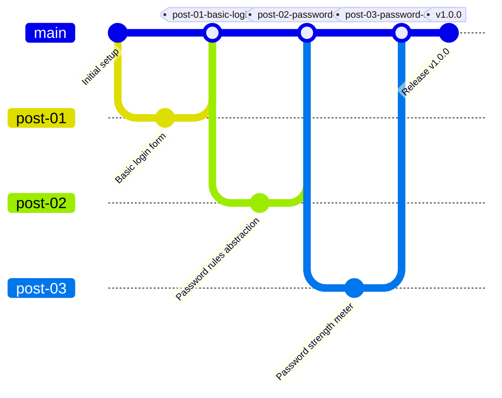

## Why This Matters

When you write a blog series that builds a feature step by step, it’s easy to accidentally treat GitHub like a folder of examples instead of what it really is: **a system for managing change over time**.

In professional environments, Git is not just about saving code — it’s about:
- isolating work
- reviewing changes
- validating quality
- preserving history
- shipping reliable software

This post explains how to structure a **single GitHub repository** so that:
- each blog post maps to a clear point in history
- the final version is fully tested and production-ready
- the workflow mirrors what teams expect in real companies

---

## The Core Mental Model

Before tools or commands, the most important thing to understand is this:

> **Branches are for working.  
> Tags are for remembering.**

Everything else builds on that idea.

---

## Branches: Living Lines of Work

A **branch** represents code that is still evolving.

When you create a branch, you are saying:
> “I am actively working on this idea.”

Branches:
- move forward as you commit
- can be merged into other branches
- are temporary by nature

Typical branch names include:

```text
feature/password-strength
post/03-password-strength
bugfix/reset-flow
```

In a blog series, branches are ideal because each article usually builds on the previous one.

---

#### Tags: Frozen Snapshots in Time

A tag is very different.

A tag:
- points to one exact commit
- never changes
- cannot be merged
- acts like a permanent bookmark

Creating a tag says:

“This is exactly what the code looked like at this moment.”

Examples:
```text
post-01-basic-login
post-02-password-rules
v1.0.0
```


Tags are what businesses use for:
- releases
- audits
- rollbacks
- historical reference

---

#### How Businesses Actually Structure Work

Most teams follow a variation of this structure:
```text
    main        → always production-ready
    feature/*   → active development
```

Some teams also use develop, but many modern teams don’t. What matters is that work never happens directly on main.

Instead:

1. Work is done on a branch
2. Changes are reviewed
3. Tests run automatically
4. Code is merged back into main

---

#### Reintegrating Work into Main (The Professional Way)

Let’s walk through the real workflow.

##### Step 1: Create a Branch from Main
```bash
git checkout main
git pull
git checkout -b feature/password-strength
```

This guarantees your work starts from the latest stable code.

---

##### Step 2: Commit While You Work

Your branch might have many commits:

- Add password rules
- Refactor validation logic
- Add strength meter UI
- Fix edge case for short passwords

This history is useful while working, but it doesn’t all belong on main.

---

##### Step 3: Open a Pull Request

Even when working solo, opening a Pull Request is best practice.

This gives you:

- a final review moment
- automatic CI checks
- a clean decision point

This is how teams protect main.

#### Squash Merge vs Merge Commit

This is one of the most important professional Git decisions.

Squash Merge (Most Common Choice)

A squash merge takes all commits on a branch and combines them into one clean commit on main.
Before merge:
```text
feature/password-strength
├─ commit A
├─ commit B
└─ commit C
```

After squash merge:
```text
main
└─ Add password strength meter
```

Why teams love squash merge:

- clean, readable history
- easy to revert features
- no noise from WIP commits

This is the default choice for:

- UI work
- blog-driven features
- incremental enhancements

---

#### Merge Commit (Used Less Often)

A merge commit preserves all commits from the branch.

Result:

- full historical detail
- more complex commit graph

Used when:

- features are long-running
- multiple developers collaborate heavily
- traceability is more important than readability

#### The Recommendation

For blog series and most frontend features:
    Use squash merge.
It’s what most modern companies expect.

---

#### Where Tags Fit in the Workflow

Tags are added after code is merged into main.
**This is critical.**


Correct order:

1. Merge branch → main
2. Create a tag on main

```bash
git checkout main
git pull
git tag post-03-password-strength
git push origin post-03-password-strength

```
This ensures:

- the tag represents production-quality code
- the snapshot is stable
- history remains trustworthy

---

#### Commit Graph: Blog Series + Production Flow

Below is a simplified commit graph showing how a blog series maps cleanly to business workflows.



Each blog post:
- starts as a branch
- merges into main
- is preserved forever as a tag

---

#### How This Supports a Blog Series

In your articles, you can link to tags, not branches:

```text
Code snapshot for this post:
`post-03-password-strength`
``

Later readers always see:

- exactly the code shown in the article
- even after main has evolved

Meanwhile, main continues to grow safely.

---

#### Testing and GitHub Actions

Because all work merges into main, this is where your strictest testing belongs.

A common setup:

- blog branches: build + lint

- main branch: build + lint + full test suite

This mirrors real production pipelines and reinforces quality.

---

#### Why This Workflow Looks Professional

When someone reviews your GitHub repo, they’ll see:

- clean main branch
- meaningful commits
- tagged milestones
- CI-enforced quality
- intentional history

This proves out how to properly ship software. 

---

#### Final Rule to Remember

If you remember nothing else, remember this:

- Branches help you build.
- Tags help you teach.
- Main is what you ship.


```bash

git checkout main
git pull
git checkout -b post/01-something 
# build code
git commit -m "Post 01: Something"
git push -u origin post/01-something

Ready to merge

git checkout main
git pull
git merge post/01-react-login-feature
git push


Tag the main with post associations


git tag post-01
git push origin post-01

```