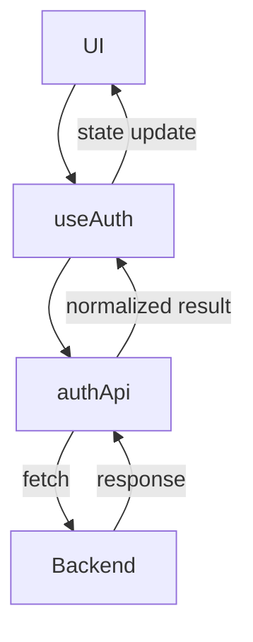
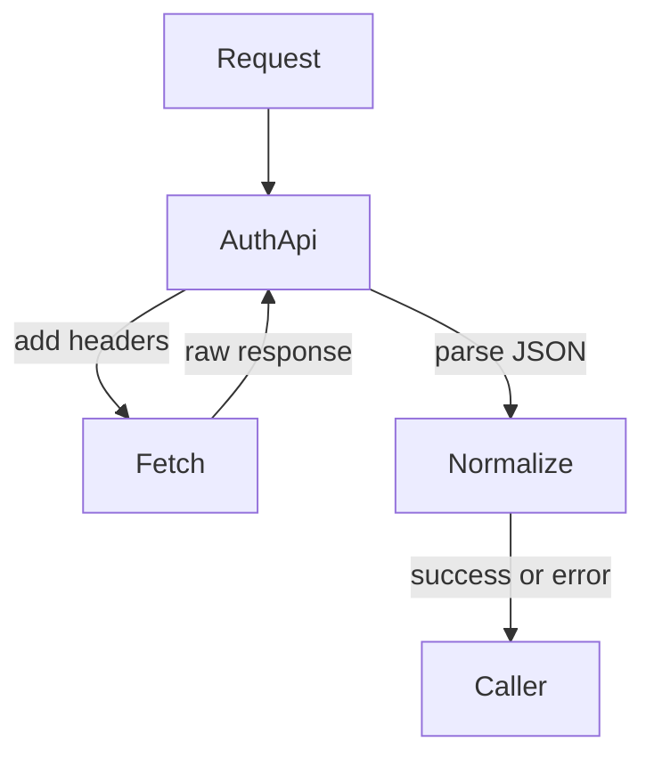
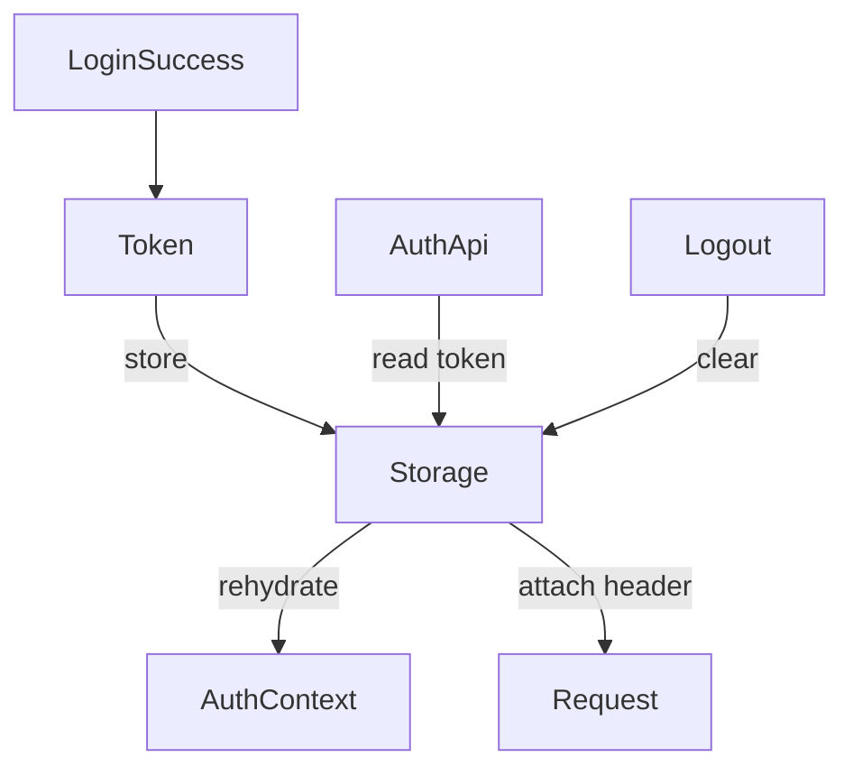
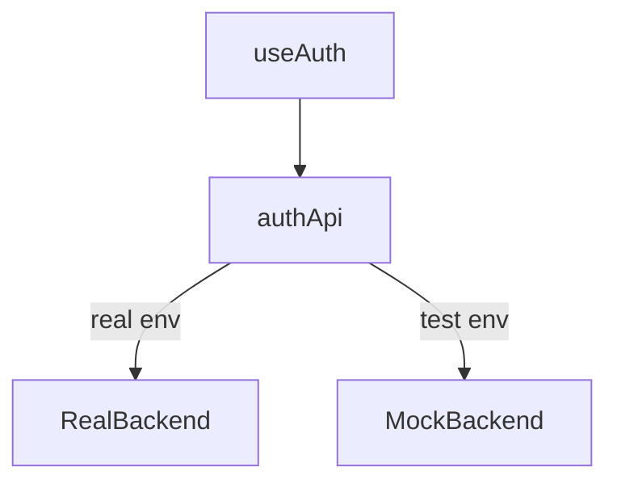

## Auth API Layer & Environment Decoupling

Your UI should never know where the authentication comes from.

A recap of what we're building, we already have the UI components integrated and useAuth handling states / effects and offering context managine the session truth. We dont yet have the boundary between what the app does and where the data comes from which we handle using the Auth API. This asspect is a separation termed decoupling.

### The Framework of API

Firstly without any such separater our fetch logic can leak into and from hooks. Additionally the testing framework becomes more difficult because they need a server to support it. Environments become hard-coded making portability more cumbersome and refactoring components can cause breaks everywhere.

When we implement an auth entication logic within the feature, it becomes portable, test with ease and swaping back ends is simple to fire up again in production environments where this setup matters. This is where `authApi.tx` takes the role.

So from a coding stand point, what authAPI is, is a thin service layer connecting back ends to the interfaces

```text
UI → useAuth → authApi → Backend

```

The UI never sees fetch. `useAuth` never sees urls and the backend can change without touching the app.

```text

src/
├─ app/
│  ├─ App.jsx
│  └─ Router.jsx
│
├─ context/
│  └─ AuthContext.jsx
│
├─ features/
│  └─ auth/
│     ├─ api/
│     │  ├─ authApi.ts        ← network boundary
│     │  └─ auth.types.ts     ← contract mirror
│     ├─ hooks/
│     │  └─ useAuth.ts
│     └─ components/

```

---

### Auth API Boundary Diagram



**Takeaways:**

- Only one file knows about endpoints
- Only one place handles headers
- Only one abstraction touches the network

```text

UI
↓
Frontend API Boundary (authApi)
↓
Endpoint Contract (black box)
↓
Backend Implementation (Express / Java / PHP)

```

---

### Fetch Wrapper: One Door In, One Door Out

Every auth request should go through the same function.

Conceptually:

```js
request(endpoint, options) → normalized result
```

This lets you:

- handle errors once
- standardize JSON parsing
- mock easily
- add logging later

---

### Diagram: Fetch Wrapper Responsibility



**Key rule**

- ❌ No fetch() in components
- ❌ No fetch() in hooks
- ✅ Only inside authApi

---

### Token Handling (Without Security Theater)

This series intentionally avoids:

- pretending localStorage is secure
- over-engineered token vaults
- false guarantees

---

#### Reality:

- Frontend tokens are session hints
- Real security lives on the backend
- The goal is consistency, not illusion

---

#### Token responsibilities in the frontend:

- store
- attach to requests
- clear on logout
- Nothing more.

---

### Diagram: Token Lifecycle



---

### Mocking APIs in Tests (This Is the Win)

Because `authApi` (`auth.service.ts`) is isolated:

- tests do not need a server
- hooks are testable
- UI is deterministic
- You can replace the entire backend with a mock.

---

### Diagram: Real vs Mock Backend Swap



Environment decides behavior — not code paths.

---

### Environment Decoupling

Your app should never care whether it’s:

- local
- staging
- production
- test

That decision lives in one place.

```js
const API_URL = import.meta.env.VITE_API_URL;
```

Or replaced entirely during tests.

---

### Final Thoughts

At this stage, the backend is treated as a black box — it may be Java, PHP, Express, or something else entirely.This post describes why the frontend needs an API boundary — regardless of backend that we will choose. No code has been checked in as we discuss architectural concepts.

### Whats Next

Our next post in the Login Series [API Endpoints]() discusses break down of api endpoints, structuring the api depending on which architectural need and prepare our system for coding the api.
