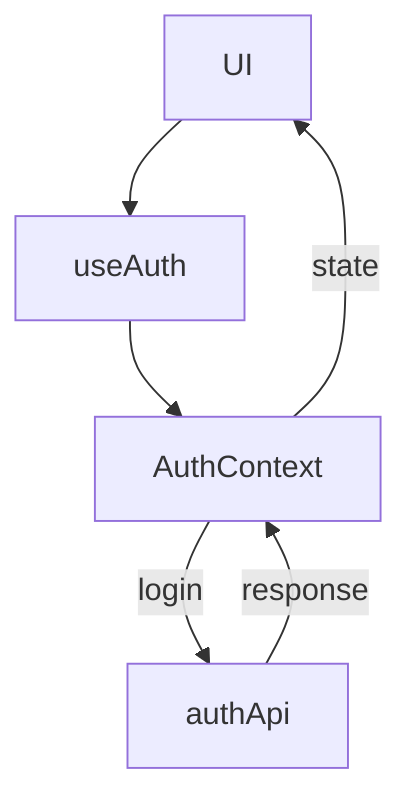

## Login Feature Series: Designing & Managing Authentication API Endpoints

In the previous post of this Login Feature Series, we focused on a technical discussion on decoupling the api from `authContext` [API decoupling]() into its own files.

A clean login feature isn’t just about forms and validation—it’s about predictable, secure, and well-scoped API endpoints that your frontend can trust.

This post walks through:

- The core authentication endpoints you need
- What each endpoint is responsible for
- How to structure and manage them as a feature (not a mess of routes)
- How this API aligns with the UI we’ve already built
- Philosophy: Feature-Based APIs (Not Random Endpoints)

Just like we structured our frontend as a Login Feature, the API should follow the same principle.

Instead of:

```text
/login
/register
/reset
/change-password
```

We think in terms of:

```text
/auth/*
```

This keeps ownership clear, improves security reasoning, and makes the feature portable.

---

### Core Authentication Endpoint Map

Here’s the minimum complete set of endpoints needed for a modern login system:

1. POST /auth/login
2. POST /auth/logout
3. POST /auth/register
4. GET /auth/me
5. POST /auth/refresh
6. POST /auth/forgot-password
7. POST /auth/reset-password
8. PATCH /auth/update-password

Each endpoint has one responsibility—no overlap, no hidden logic.

---

#### 1. POST /auth/login

Purpose:Authenticates a user using credentials (email + password).

**Responsibilities**

- Validate credentials
- Reject invalid logins
- Issue tokens (access + refresh)
- Return user-safe profile data

Example Response Shape

```json
{
  "user": {
    "id": "123",
    "email": "user@example.com",
    "name": "Crystal"
  },
  "accessToken": "...",
  "refreshToken": "..."
}
```

{: .note}
**Important Rule:**
Never return sensitive fields (password hash, internal flags).

---

#### 2. POST /auth/logout

Purpose: Ends the user session.

**Responsibilities**

- Invalidate refresh token (server-side)
- Clear cookies if used
- Return success state

This endpoint is simple—but critical for security.

---

#### 3. POST /auth/register

Purpose: Creates a new user account.

**Responsibilities**

- Validate input (email format, password rules)
- Enforce uniqueness
- Hash password
- Create user record
- (Optionally) auto-login after success

Your frontend password rules already exist—this endpoint must enforce the same rules.

---

#### 4. GET /auth/me

Purpose: Returns the currently authenticated user.

**Responsibilities**

- Verify access token
- Return user profile
- Act as a session truth source

This endpoint powers:

- Route guards
- Page refresh persistence

Auto-login flows

If /auth/me fails → user is logged out.

---

#### 5. POST /auth/refresh

Purpose: Issues a new access token.

**Responsibilities**

- Validate refresh token
- Rotate tokens (best practice)
- Return new access token

Your frontend should never guess auth state—it asks the API.

---

### 6. POST /auth/forgot-password

Purpose: Starts the password reset flow.

**Responsibilities**

- Accept email
- Generate reset token
- Send email (or mock it in dev)
- Always return success (prevent user enumeration)

Example safe response:

```json
{ "message": "If an account exists, an email has been sent." }
```

---

#### 7. POST /auth/reset-password

Purpose: Completes password reset using a token.

**Responsibilities**

- Validate reset token
- Validate new password
- Update password securely
- Invalidate token

This connects directly to your Confirm Reset Password UI.

---

#### 8. PATCH /auth/update-password

Purpose: Changes password for logged-in users.

**Responsibilities**

- Require authentication
- Validate current password
- Validate new password
- Update securely

This endpoint is different from reset—and should stay separate.

---

#### API ↔ UI Mapping (Why This Matters)

Your frontend already reflects this structure:

| UI Screen       | API Endpoint                |
| --------------- | --------------------------- |
| Login Page      | POST /auth/login            |
| Signup Page     | POST /auth/register         |
| -----           | -----                       |
| Route Guard     | GET /auth/me                |
| -----           | -----                       |
| Forgot Password | POST /auth/forgot-password  |
| -----           | -----                       |
| Reset Password  | POST /auth/reset-password   |
| -----           | -----                       |
| Change Password | PATCH /auth/update-password |
| -----           | -----                       |
| Logout Button   | POST /auth/logout           |
| -----           | -----                       |

This 1:1 mapping keeps your app predictable and debuggable.

---

#### Error Handling Strategy

All auth endpoints should follow a consistent error shape:

```json
{
  "error": "Invalid credentials",
  "code": "AUTH_INVALID"
}
```

---

##### Why?

- Frontend can map errors to UI
- Guards can respond correctly
- Logs stay meaningful

---

#### Security Rules (Non-Negotiable)

- Never expose internal IDs unnecessarily
- Never confirm whether an email exists
- Always hash passwords
- Always validate input server-side
- Rotate refresh tokens
- Expire reset tokens
- Your UI is helpful.
- Your API is authoritative.

---

### Mental Model Of Express.js setup

```text
UI → useAuth → AuthContext → Storage
                     ↓
                  authApi
```

- useAuth talks to Context
- Context owns session state
- API + Storage are implementation details

### Diagram: Auth Context as the App Authority



---

#### Final Thought

A login system isn’t “done” when the form works.
It’s done when every endpoint has a clear job, a clear contract, and a clear owner. The endpoints are Backend-Agnostic Contracts and can be used to integrate in-house backends or third-party services. Backend language only matters when you cross the auth api boundary. This API design gives your Login Feature a backbone you can scale, test, and reuse.

---

### Whats Next

Our next post in the Login Series [API Code]() discusses break down of express api code setup, structuring the api depending on in-house development or black box endpoints, which architectural needs and prepare our system to add coding the api.
