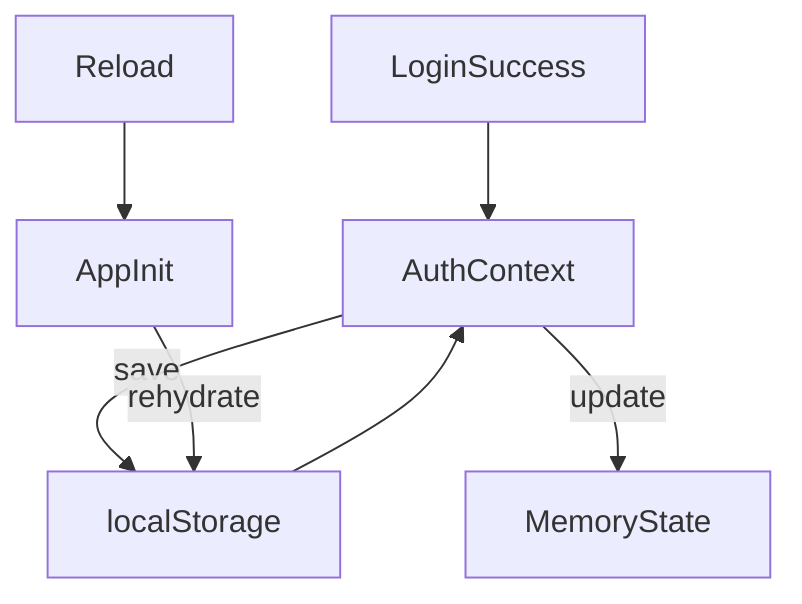
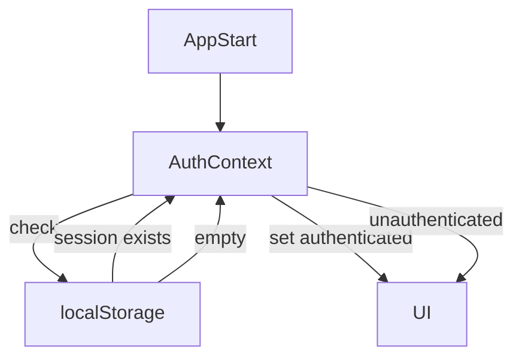
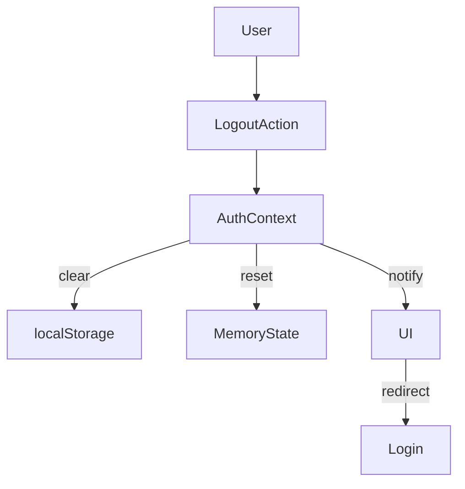

## Post 5: Auth Context: Session, Persistence & Logout
“Authentication is not a form. It’s application state.”


Next logical posts in the series:

Implementing the API Layers (Node / Express / Nest / etc.) [Part 4 c Coding]()  the endpoints.

- Token storage strategies (cookies vs memory)
- Connecting the API to the AuthContext
- End-to-end login flow walkthrough

---

### Why Auth Context Exists

By now we have:

- UI components (Post 2)
- useAuth hook managing async state (Post 3)
- authApi abstracting the backend (Post 4)

What we still don’t have is a single source of truth for:

- whether the user is logged in
- who the user is
- how long the session lives
- how the app reacts to logout

That responsibility belongs to Auth Context.

---

### The Role of AuthContext

AuthContext is:

- the app’s authentication authority

- session state manager

- persistence coordinator

AuthContext is not:

- responsible for forms

- making network requests directly

- aware of UI layout

- tied to any one route

Think of it as application infrastructure, not a feature component.
---


### Session State: What Do We Store?

At minimum:

- authentication status

- user info (if needed)

- token (or session id)

Example shape:
```js
{
  user: null | { id, email },
  token: null | string,
  isAuthenticated: boolean
}
```
#### Rule

If the app needs it globally → Context owns it.

---

### Memory vs localStorage (The Honest Tradeoff)
#### In-Memory State

- ✅ Secure against XSS persistence
- ❌ Lost on refresh
- ❌ Requires re-login

#### localStorage

- ✅ Survives reloads
- ✅ Simple to implement
- ❌ Accessible to JS

This series chooses localStorage intentionally, without pretending it’s more secure than it is.

---

### Diagram: Session Persistence Flow


---

### Rehydration on Reload

On app start:

1. Context checks storage

2. Valid session restores state

3. UI updates immediately

No flicker. No guessing.
 
---

###  Diagram: App Startup Rehydration


---
Logout Patterns (Simple, Predictable)

Logout should:

- clear storage
- reset memory state
- redirect user
- invalidate session hints

Nothing else.

---
🚪 Diagram: Logout Flow


```text
src/
├─ app/
│  ├─ App.jsx
│  └─ Router.jsx
│
├─ context/
│  └─ AuthContext.jsx
│
├─ features/
│  └─ auth/
│     ├─ components/
│     │  ├─ LoginForm.jsx
│     │  ├─ PasswordInput.jsx
│     │  ├─ AuthError.jsx
│     │  └─ AuthCTA.jsx
│     ├─ hooks/
│     │  └─ useLogin.js
│     ├─ services/
│     │  └─ authApi.js
│     ├─ validators/
│     │  └─ loginSchema.js
│     ├─ tests/
│     │  ├─ LoginForm.test.jsx
│     │  └─ useLogin.test.js
│     └─ index.js
│
└─ main.jsx

```

---

### App-Level Integration

AuthContext should wrap everything that depends on session state.

Typically:
```jsx
<AuthProvider>
  <Router />
</AuthProvider>
```

This ensures:

- routes respond to auth changes

- logout works everywhere

- session is consistent

### Why Context (Not Props, Not Redux)

Context wins here because:

- scope is global
- updates are infrequent
- semantics are clear
- no external dependency needed

This is exactly what Context was built for.

---

### What This Enables Next

With Context in place:

- protected routes are trivial
- logout is universal
- session persistence “just works”
- testing becomes straightforward

{: .note}

Tiis area is still to be defined as we refine our login series code base. tbd. Sorry for the inconvenience.


Review the code found in Github [Post 5 Session Persistence](https://)


---

### Post 6 Preview: Testing the Login Feature (RTL + Jest)

Next we’ll cover:

- mocking authApi
- testing context behavior
- asserting auth flows
- avoiding brittle UI tests

This is where everything pays off.


 [Post 6 Testing ](}