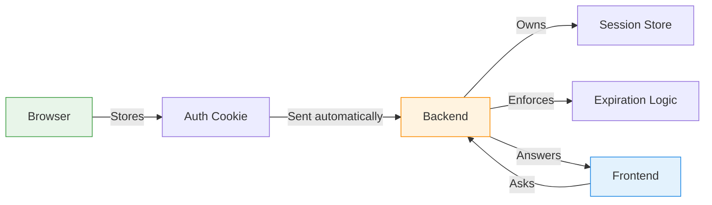
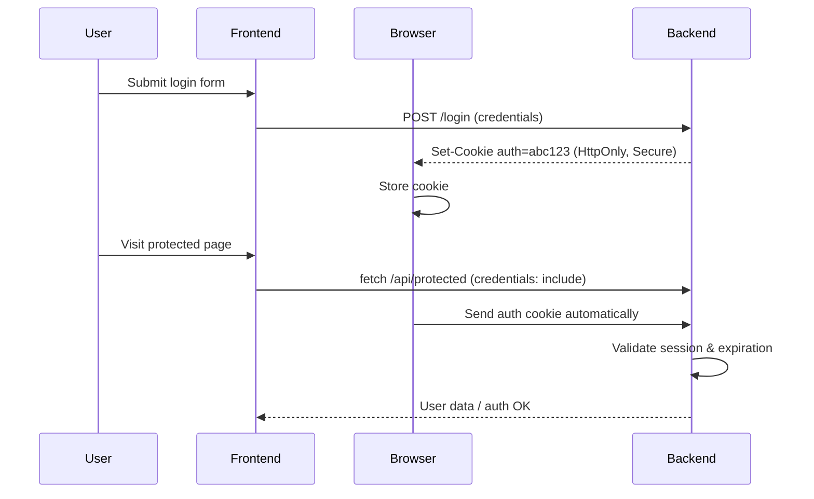

## Convert a Token Auth System to a Cookie Based

In the previous post, we built a token-in-localStorage authentication context, where the frontend owned the authentication lifecycle:

- storing the token
- rehydrating auth state
- checking expiration
- deciding whether a user was logged in

That model works — especially for MVPs — but it pushes too much responsibility into JavaScript.
Check out the branch on github at [Post 5 Persistence](https://github.com/cryshansen/login-feature-react/tree/post/post5-persistence)

In this post, we refactor that same system into a cookie-based authentication model, while keeping the AuthContext reusable, testable, and switchable between cookie and token models.

Both approaches solve real problems.
They simply optimize for different constraints.

---

#### The Core Shift: Who Owns Authentication?

**_Token-based auth_**

- The frontend owns the session.
- It stores the token
- It checks expiration
- It decides when auth is valid

**_Cookie-based auth_**

- The browser + backend own the session.
- The browser stores and sends the cookie
- The backend validates it
- The frontend just asks for state
- This refactor is about moving ownership out of JavaScript.

---

#### Cookie-Based Auth (HttpOnly Session or JWT)

At a high level, cookie-based authentication works like this:

##### 1. User logs in

The frontend submits credentials.

---

##### 2. Backend sets an HttpOnly cookie

On success, the backend responds with a cookie header:

```
  Set-Cookie: auth=abc123; HttpOnly; Secure; SameSite=Lax
```

This cookie:

- cannot be accessed by JavaScript (HttpOnly)
- is sent only over HTTPS (Secure)
- is attached automatically to same-site requests (SameSite=Lax)

---

##### 3. The browser takes over

From this point on, the browser:

- stores the cookie
- attaches it to requests
- enforces transport and scope rules
- No frontend token handling is required.

---

##### 4. The frontend asks — it doesn’t decide

```js
fetch("/api/protected", {
  credentials: "include",
});
```

The cookie is attached automatically.
The frontend never sees the token and never calculates expiration.

---

#### Ownership & Responsibility



---

**Request Lifecycle**



---

### Why This Matters

With cookie-based auth:

- the frontend becomes simpler
- token exposure is eliminated
- logout is real (server-side)
- session rules live where they belong
- Authentication becomes harder to misuse accidentally.

---

### Updating the AuthContext (What Actually Changes)

**_Before (token-based)_**

Auth state was rehydrated from storage:

```js
const authuser = JSON.parse(localStorage.getItem("auth_user"));
```

Guards checked:

```js
!!authuser?.token;
```

The frontend owned correctness.

**_After (cookie-based)_**

AuthContext now boots by asking the server:

```js
useEffect(() => {
  fetch("/api/auth/me", {
    credentials: "include",
  })
    .then((res) => (res.ok ? res.json() : null))
    .then((data) => setAuthUser(data?.user ?? null))
    .finally(() => setAuthReady(true));
}, []);
```

That’s the entire shift.

- No tokens
- No expiration math
- No localStorage

- Server truth

---

### Making Auth Switchable (Token or Cookie)

To keep this a drop-in feature, the context was refactored to support both modes.

```js
export const AUTH_MODE: "cookie" | "token" = "cookie";

```

- Cookie mode → /auth/me decides state
- Token mode → localStorage is used
- Guards don’t care which mode is active

This lets you:

- develop locally with tokens
- deploy securely with cookies
- keep one AuthContext

---

### Telemetry: Observability Without Coupling

During the refactor, auth telemetry was added without affecting auth flow.

```js
emitAuthEvent("login_success", { userId });
emitAuthEvent("login_failure", { email });
emitAuthEvent("password_reset_requested");
```

---

#### Telemetry is:

- fire-and-forget
- non-blocking
- decoupled from auth correctness
- Auth still works even if telemetry fails.

---

#### Mental Model Shift

**_Token auth asks:_** “Do I still have a valid token?”

**_Cookie auth asks:_** “Server, who am I?”

That’s it.

Once you internalize that, most frontend auth code disappears.

---

### Pros & Cons

**\* Pros (why production apps prefer cookies)**

- HttpOnly → XSS safe
- Automatic sending
- Real server logout
- Silent refresh
- Short-lived sessions
- Simpler frontend logic

**_ Cons _**

- Requires backend support
- Needs CORS + SameSite setup
- Slightly harder locally
- Cookies behave differently on mobile

---

##### Side-by-Side Comparison\*\*

| Feature                  | LocalStorage Token | Cookie Auth |
| ------------------------ | ------------------ | ----------- |
| Token readable by JS     | ✅ Yes             | ❌ No       |
| XSS resistant            | ❌ No              | ✅ Yes      |
| Logout truly invalidates | ❌ Mostly          | ✅ Yes      |
| Frontend complexity      | High               | Low         |
| Backend complexity       | Low                | Medium      |
| Best for MVP             | ✅                 | ⚠️          |
| Best for production      | ⚠️                 | ✅          |

---

### Which to use?

For this login feature project:

✔ Complex auth flows
✔ Email verification
✔ Password resets  
✔ Route guards
✔ Real backend

We built one AuthContext that supports both models. That’s the real win — not choosing cookies or tokens, but designing auth so ownership is explicit and changeable.

Review the code branch found at [Post 5b Cookie Auth](https://github.com/cryshansen/login-feature-react/tree/post/post5b-cookie-auth)

---

### Post 6 Preview: Testing (RTL + Jest)

Next we’ll cover:

- mocking authApi
- testing context behavior
- asserting auth flows
- avoiding brittle UI tests

This is where everything pays off. [Post 6 Testing ]()
