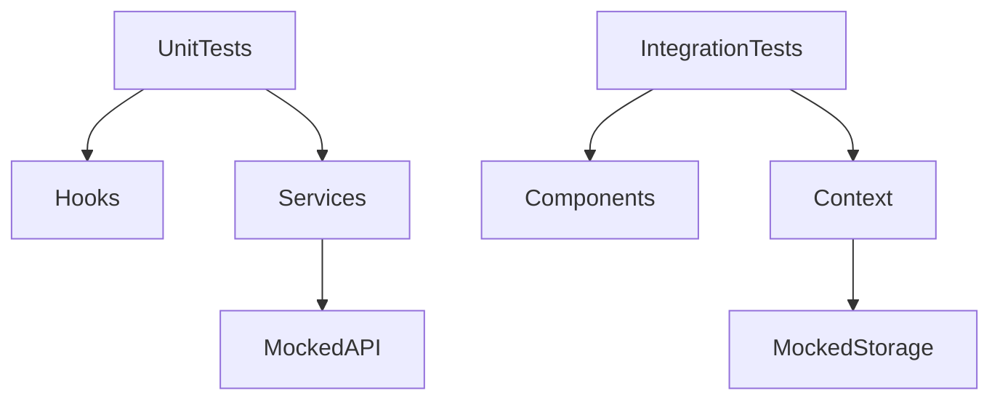
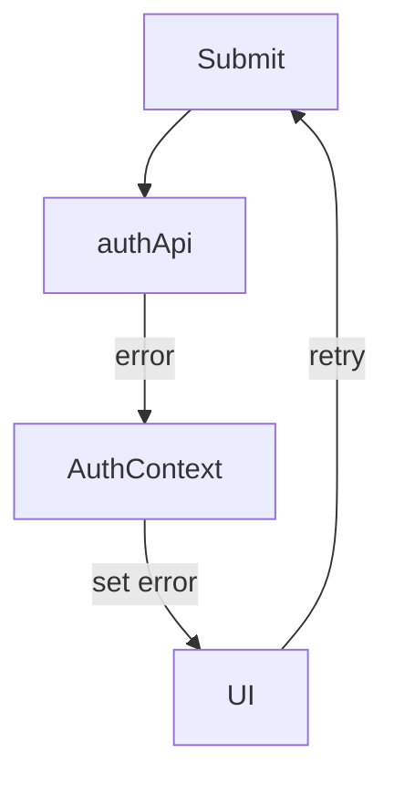
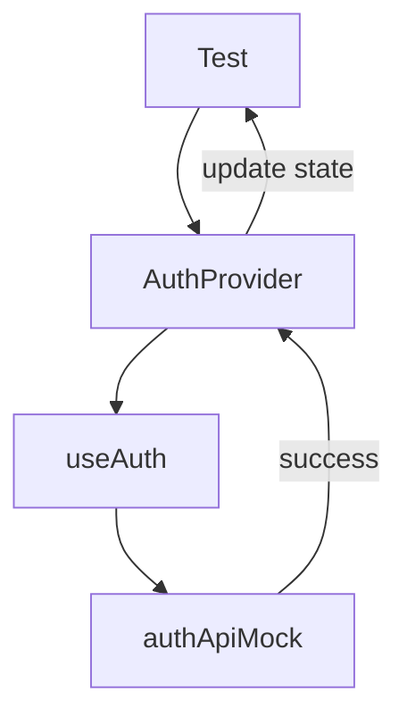

## Post 6: Testing the Login Feature (RTL + Jest)

“Tests don’t prove your code works. They prove you understand what matters.”

Everything we’ve built so far — hooks, services, context — was designed to make testing possible without pain. This post shows how those decisions pay off.

We started with applying some code standard rules that we can test locally to clean up prior to any releases or pushes to main branch. This was briefly discussed and we will follow up on how it is handled. Then we dive into building test cases and defining Git Actions to run on every push. All these files can be found in the latest post on github.

Lets grab the code from our last post, branch found at [Post 5b Cookie Auth](https://github.com/cryshansen/login-feature-react/tree/post/post5b-cookie-auth)

---

### Why ESLint?

ESLint helps developers manage team coding standardizing naming and conventions other simple bug flagging. This is extremely valuable to help isolate and fix bugs before sharing with teams.It analyzes code statistically. And help alleviate some developer resources and turn around time. Lint rules are automated code checks that run while you write code (or before commits/builds) to:

- Catch bugs early
- Enforce consistent style
- Prevent dangerous patterns
- Warn you before runtime errors happen

This is a very nice feature to enable for code review simplification. For instance, the code accidentally uses the same name in the api as the context therefore a lint rule and 'Api' naming convention on the api calls. We can add a rule for this a `functions with the same name in the same scope`.

#### ESLint Setup

Install ESLint and typscript eslint for our context and service files

```bash
npm install -D eslint eslint-plugin-react eslint-plugin-react-hooks eslint-plugin-import
npm install -D @typescript-eslint/parser @typescript-eslint/eslint-plugin
npm install -D eslint-plugin-import
```

create a .eslintrc.cjs file and paste this base code:

```js
/* eslint-env node */
module.exports = {
  root: true,

  env: {
    browser: true,
    es2021: true,
  },

  parserOptions: {
    ecmaVersion: "latest",
    sourceType: "module",
  },

  plugins: ["react", "react-hooks", "import"],

  extends: ["eslint:recommended", "plugin:react/recommended", "plugin:react-hooks/recommended"],

  rules: {
    /* =========================
       CRITICAL BUG PREVENTION
    ========================= */

    // Prevent accidental recursion & shadowing
    "no-shadow": "error",
    "no-use-before-define": ["error", { functions: false }],

    // Prevent silent async failures
    "no-floating-promises": "off",
    "no-return-await": "error",

    // Enforce consistent function behavior
    "consistent-return": "error",

    /* =========================
       AUTH ARCHITECTURE GUARDS
    ========================= */

    // Contexts must not import API services incorrectly
    "import/no-cycle": "error",

    // Enforce naming conventions
    "import/no-named-as-default": "error",

    /* =========================
       REACT SAFETY
    ========================= */

    "react/prop-types": "off", // using TS or not strict props
    "react/react-in-jsx-scope": "off",

    /* =========================
       QUALITY OF LIFE
    ========================= */

    "no-console": ["warn", { allow: ["warn", "error"] }],

    /*========================
     CONTEXT  <> SERVICE RECURSION
    ==============================*/
    "import/no-restricted-paths": [
      "error",
      {
        zones: [
          {
            target: "./src/features/api",
            from: "./src/contexts",
            message: "API services must not import Contexts",
          },
          {
            target: "./src/contexts",
            from: "./src/features/api",
            message: "Contexts must not import API services directly",
          },
        ],
      },
    ],
    "no-restricted-globals": [
      "error",
      {
        name: "requestPasswordReset",
        message: "Use requestPasswordResetApi for API calls",
      },
    ],
  },

  settings: {
    react: {
      version: "detect",
    },
  },
};
```

Add a reference to lint in package.json

```json
{
  "scripts": {
    "lint": "eslint . --ext .js,.jsx,.ts,.tsx"
  }
}
```

Next run lint in command line to see errors and recommended fixes:

```bash
npm run lint

```

At this point some errors still exist and can be viewed using the last branch found at [Post 5b Cookie Auth](https://github.com/cryshansen/login-feature-react/tree/post/post5b-cookie-auth) so that we can fix remaining code in this post. We will look closely at running unit test and integration testing, form Ui testing.

### What We’re Testing (and What We’re Not)

Before writing a single test, we define scope.

✅ We test:

- business logic
- auth state transitions
- success and failure paths
- user-visible behavior

❌ We don’t test:

- CSS classes
- animations
- implementation details
- third-party libraries

  If a test breaks when you rename a class — it’s a bad test.

---

### Testing Strategy Overview

| Layer     | Type              | Tool |
| --------- | ----------------- | ---- |
| Hooks     | Unit tests        | Jest |
| API layer | Unit tests        | Jest |
| Context   | Integration tests | RTL  |
| Forms     | Integration tests | RTL  |

---

### 🧪 Unit vs Integration Tests (Clear Boundaries)

##### Unit Tests

- isolated
- no DOM
- no routing
- no storage

###### Examples:

- useAuth
- authApi

##### Integration Tests

- real components
- mocked boundaries
- user behavior driven

###### Examples:

- login form flow
- error rendering
- redirect after login

---

### Diagram: Test Coverage Boundaries



---

### Mocking the Network (authApi)

We never hit a real backend in tests.
Instead:

- mock authApi
- control success/failure
- assert behavior

### Example

```js
jest.mock("../services/authApi", () => ({
  login: jest.fn(),
}));
```

This allows:

- deterministic tests
- fast execution
- no environment dependency

---

### Testing Failure States (Where Bugs Live)

Success paths are easy. Failures reveal architecture.

We explicitly test:

- invalid credentials
- network errors
- empty responses
- retry behavior

---

### Diagram: Failure & Retry Loop



```text
src/
├─ app/
│  ├─ App.jsx
│  └─ Router.jsx
│
├─ context/
│  └─ AuthContext.jsx
│
├─ features/
│  └─ auth/
│     ├─ components/
│     │  ├─ LoginForm.jsx
│     │  ├─ PasswordInput.jsx
│     │  ├─ AuthError.jsx
│     │  └─ AuthCTA.jsx
│     ├─ hooks/
│     │  └─ useLogin.js
│     ├─ services/
│     │  └─ authApi.js
│     ├─ validators/
│     │  └─ loginSchema.js
│     ├─ tests/
│     │  ├─ LoginForm.test.jsx
│     │  └─ useLogin.test.js
│     └─ index.js
│
└─ main.jsx

```

---

### Testing Context Behavior

AuthContext is tested through consumers, not directly.

We verify:

- session stored
- state updated
- logout clears state
- rehydration works

Rule

If you test Context directly, you’re testing implementation — not behavior.

---

### Diagram: Context Integration Test Flow



---

### Asserting Auth Flows (End-to-End Without E2E)

We simulate:

- User types credentials
- Submits form
- API resolves
- Context updates
- UI redirects

All inside JSDOM — no browser automation required.

---

### Example: Login Success Flow (Conceptual)

```text
render LoginForm
→ fill inputs
→ click submit
→ expect loading
→ expect redirect
```

That’s it.
No sleep. No timers. No hacks.

---

### Avoiding Brittle UI Tests

##### Bad tests:

- checking class names
- snapshot testing entire pages
- asserting exact markup

##### Good tests:

- getByRole
- getByLabelText
- findByText
- asserting what the user sees

---

### What This Architecture Makes Easy

Because we separated:

- API
- hooks
- context
- UI

We can:

- mock cleanly
- test in isolation
- refactor safely
- trust changes

---

### Why This Matters in Real Teams

These tests:

- catch regressions
- document intent
- allow refactors
- reduce fear

This is how features survive iteration.

---

#### Getting into code

We need to install vitest and jest

```bash
npm install -D vitest jsdom @testing-library/react @testing-library/jest-dom @testing-library/user-event

npm i -D @testing-library/user-event

npm install --save-dev msw

```

Open your vite.config.js (.ts) and configure the test property to the defineConfig

Create a setup.ts setup file.

update the package.json to add scripts

```

```

##### sample test case of login

Setup vitest

```ts
import { describe, it, expect, vi, beforeEach } from "vitest";
import { login } from "../services/auth.service";

beforeEach(() => {
  vi.restoreAllMocks();
});

describe("auth.service login()", () => {
  it("calls /auth/login with correct payload", async () => {
    global.fetch = vi.fn().mockResolvedValue({
      ok: true,
      json: async () => ({
        user: { id: "1", email: "test@test.com", name: "Test" },
        accessToken: "token",
      }),
    } as any);

    await login({
      email: "test@test.com",
      password: "password123",
    });

    expect(fetch).toHaveBeenCalledWith(
      "/auth/login",
      expect.objectContaining({
        method: "POST",
        body: JSON.stringify({
          email: "test@test.com",
          password: "password123",
        }),
      })
    );
  });

  it("throws a readable error on failure", async () => {
    global.fetch = vi.fn().mockResolvedValue({
      ok: false,
      json: async () => ({ error: "Invalid credentials" }),
    } as any);

    await expect(login({ email: "bad@test.com", password: "wrong" })).rejects.toThrow("Invalid credentials");
  });
});
```

### Series Wrap-Up (What You Now Have)

By Post 6, you’ve built:

```text
✔ Reusable login feature
✔ Decoupled API layer
✔ Centralized session management
✔ Predictable auth flows
✔ Test coverage that matters
```

This is production-level authentication, minus the cargo cult.

Review the finalized code found in Github [Post 6 Testing](https://github.com/cryshansen/login-feature-react/tree/post/post6-testing). You can follow along with the next part of our series with post 7 - feature cleanup and test dropin directions. Our Series too a few different directions as we solidify a professional login feature while exporing the React frameworks.

---

### Detailed Testing Suite

Because this feature is intended for a production environment, we pushed the tesing to ensure full range of tests would give us confidence our system is clean and running as expected. Many layers have been implemented in this series with eslint code standards through to thorough testing components, contexts, integrations and service layers.

A more detailed structure of the testing Suite can be found in blog post: [Login Testing Suite]()

In the git Repo the Feature Test Plan can be reviewed for details on each test file and its intent.

---

### Bonus: test cases you now enable a multiflow test framework.

```text
✔ Logged-out user → /profile → redirected
✔ Logged-in user → /login → redirected
✔ Missing token → /reset-confirm → redirected
✔ Valid token → page renders
```

This is exactly what interviewers look for.

Final Posts
Next up:

- Post 7 : Reusing the Feature in Another App
- Optional: what Id Do Differently next time.

Lets now take what we have and test dropin instructions with the next post at [Login Dropin Feature]()
