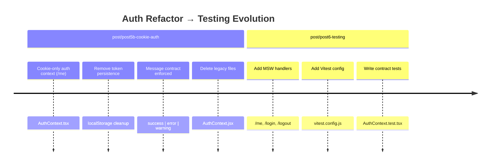
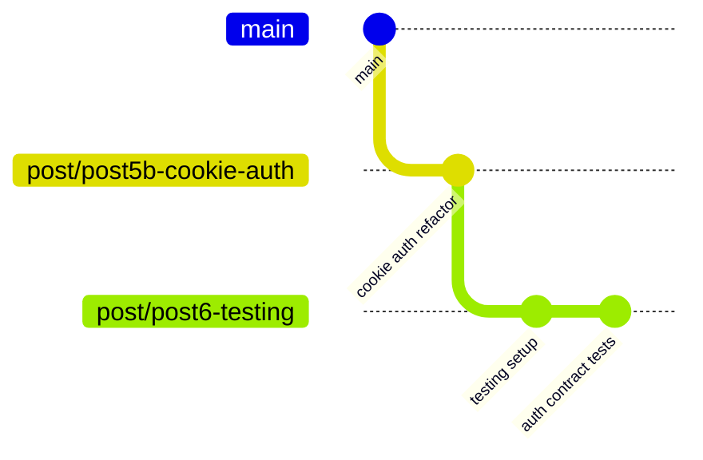

## Why Branch Discipline in Git Isn’t Optional (And How It Saved This Auth Refactor)

When people first learn Git, branching often feels optional — something you do sometimes, mostly when things get messy.

In reality, branch discipline is what prevents messes from ever happening.

This post explains why branches matter, when to split work, and how Git gives you escape hatches — using a real refactor from a cookie-based auth system as the example. The cookie based system is part of a Login Feature React Post series. While switching from a MVP of localstorage to cookie authentication base, development needs to pause with normal branch cycle processes. See the github branch usage at [Login Feature](https://github.com/cryshansen/login-feature-react/) and review the branches in dropdown. These branches match the posts associated to the code base.

---

### The General Problem

Modern features aren’t linear. A single “feature” often involves:

- Refactoring existing code
- Changing types/contracts
- Removing old files
- Adding tests
- Adjusting tooling (ESLint, Vitest, etc.)

If you do all of that on one branch, you create problems:

- You can’t publish intermediate posts
- You can’t reason about regressions
- You can’t roll back safely
- You can’t explain what changed and why

Git branches are how you control narrative and risk.

---

### The Real Example: Cookie-Based Auth + Tests



#### The goal

**_Post 5b: Convert auth to cookie-only, /me identity changes._**
Normally, I check in to a new branch when the code is finalized then merge with main, then create a new branch and pull main into it. This is a choice so people can follow along on the login-feature post series via the code. However I still wasnt convinced the cookie auth was a clean code body. The switching feature from localstorage to cookie was over-kill for the projects final product. This meant a refactor was likely. I didnt want to merge it into main until i was certain this was a clean copy of cookie based authentication. It was clearly necessary to separate at this time. The biggest reason was the changes made to implement typescript for field mappings and separation of direct api calls within this cookie auth system.

**_Post 6: Add contract tests using MSW + Vitest_**
At the same time, working on code standards and testing files to get a better sense of the change impact, I created branch 6 to correlate those changes. This means, post6 is ahead of 5b and we need to merge the changed files back into post5-cookie-auth. We dont want to include the testing files in 5b however. These are related — but they are not the same change.

---

### What Went Wrong (On Purpose)

During the cookie auth code completion, the idea of switching between the auth `types` (localStorage vs Cookie )many development changes occurred:

- The AuthContext was converted from JS → TSX
- Token logic was removed
- /me became the single identity resolver
- Message contracts were enforced
- Old files were deleted
- Test infrastructure was added

At one point, the working tree looked like this:

```text
new file:   src/context/AuthContext.tsx
deleted:    src/context/AuthContext.jsx
deleted:    src/_tests_disabled/slugify.test.js
modified:   auth.service.ts
modified:   auth.types.ts
untracked:  src/features/_tests_/
untracked:  vitest.config.js
```

This is the exact moment where branch discipline really matters.

---

### The Key Insight

Not everything that changed belongs in the same post. In this example our branches are intended to replicate the blog posting of code for the feature. (5b-cookie-auth vs post6-testing)

- Auth refactor = Post 5b
- Tests + tooling = Post 6

So we split them.

---

### The Correct Strategy



#### Keep Post 5b pure

Only include:

- Cookie-only AuthContext
- /me identity resolution
- Message contract cleanup
- File deletions related to auth

That work was committed and pushed to: post/post5b-cookie-auth

---

#### Move ahead without fear

A new branch was created:
post/post6-testing

This branch is allowed to:

- Add MSW handlers
- Add Vitest config
- Add contract tests
- Modify tooling
- No pressure to “finish” everything at once.

---

#### The Recovery Moment (This Is the Lesson)

Even after branching, things got mixed temporarily.

Instead of panic:

- We cherry-picked the correct commit back into post/post5b-cookie-auth
- Git detected the commit already existed during rebase
- The history stayed clean
- Nothing broke

This is Git doing its job.

---

#### Why This Matters

Without branches:

- You rewrite history
- You squash unrelated ideas
- You lose teaching clarity
- You risk regressions

With branches:

- Each post has a clean narrative
- Refactors are explainable
- Tests land when they’re ready
- You can pause and resume safely

---

#### The Mental Model That Helps

Think of branches like chapters in a book:

- Each chapter should stand on its own
- You can reference earlier chapters
- You shouldn’t leak future material backward

Git branches enforce that discipline technically, so you don’t have to rely on memory.

---

### Final State (The Ideal Outcome)

- post/post5b-cookie-auth → Cookie auth refactor only
- post/post6-testing → Contract tests + MSW + Vitest
- Clean history
- Clear posts
- No rewrites
- No stress

---

### Takeaway

Git isn’t just version control.

It’s:

- Architecture protection
- Teaching structure
- Fear removal
- A safety net for thinking clearly

If your feature feels “too big for one commit” — it is. Split it early. Your future self (and your readers) will thank you.
