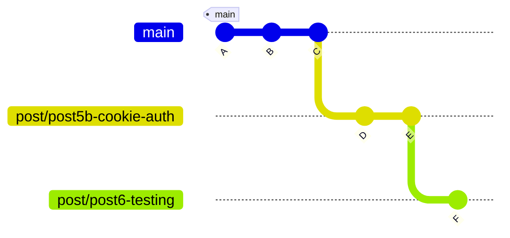
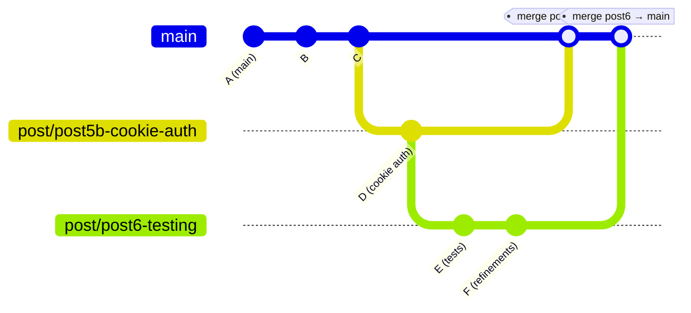

## What Git Never Explains: Stacked Branches & Merge Order

Git is excellent at telling you what it’s doing.
It’s much worse at explaining why — especially when everything is technically correct but feels very wrong.

Recently, I ran into a situation Git handled perfectly… and explained not at all.

This post is about stacked branches, why they happen naturally, and how understanding Git’s mental model turns a scary moment into a non-event.

### The situation

I had two feature branches:

```bash
post/post5b-cookie-auth
post/post6-testing
```

- post5b-cookie-auth contained a complete feature
- post6-testing was built on top of that work
- I merged post5b → post6
- I did not merge post5b → main
- Then I pushed both branches to GitHub

At that point, everything worked — but I paused. I knew I also need to restructure the app into a solid dropin feature which means some further refactoring away from full app to a drop in feature ready to add on stack. My dilemma was now what to do with these branches. They both need to check in. Post 5 is refactored and finalized from a code base requirement for cookie auth and post 6 is finalized test cases.

## How do I merge these into main without duplicating commits or breaking history?

Git didn’t warn me.
GitHub didn’t complain.
But Git also didn’t explain what was happening either.

## What Git doesn’t explain

Git does not think in terms of features, tickets, or intent. Git only cares about commit ancestry. That’s it.

If one branch contains commits from another branch, Git considers that relationship real — regardless of whether main has seen those commits yet. This is where the confusion usually starts.

Seeing the truth with git log --graph. When Git feels confusing, the fastest way to understand reality is to look at the graph.

```
git log --oneline --graph --decorate --all
```

Conceptually, my history looked like this:

```text
* F  (post/post6-testing)
* E
* D  (post/post5b-cookie-auth)
* C
* B
* A  (main)
```

## Git Commit Graph (Stacked Branches)



Important observations:

- post6-testing already contains post5b-cookie-auth
- main contains neither

- Commits have a strict parent → child relationship

This leads to the rule Git never states explicitly:

Branches must be merged into main in the same order they were built.

### The correct merge order

Because post6-testing is built on top of post5b-cookie-auth, the merge order must be:

1. Merge the base branch first

```
post/post5b-cookie-auth → main
```

Once this is merged, main now includes all commits up to D.

2. Merge the stacked branch

```
post/post6-testing → main
```

#### Diagram Showing the Merge Order

When you merge everything properly your merge order would look like this graph:



post6-testing is built on top of post5b-cookie-auth, so the base branch must land in main first. Git will then apply only the new commits when merging the stacked branch. If your branches form a stack, your merges must follow the stack.

#### Git (and GitHub) will automatically:

- Skip commits already in main
- Apply only the new work
- Keep history clean

This is expected behavior — not magic, not duplication, not a bug.

---

### Why this feels scary (even though it’s fine)

At this point, most developers are thinking:

- “Am I going to re-merge commits?”
- “Will this break history?”
- “Should I rebase instead?”
- “Did I mess something up earlier?”

The anxiety comes from Git hiding the mental model. Once you realize Git only follows commit ancestry, the fear disappears. If GitHub shows a clean diff, Git is doing exactly what it should.

### Stacked branches are not a mistake

This workflow happens naturally when:

- One feature builds on another
- You want smaller, reviewable changes
- You’re working incrementally (auth → tests → refinements)

In other words: real-world development. Stacked branches aren’t sloppy — they’re a sign of intentional sequencing.
The only requirement is understanding merge order.

### The mental model to remember

If you remember nothing else, remember this:

Git doesn’t care where you meant to merge.
Git only cares which commits already exist.

And therefore: **_Ancestors must land before descendants._**

## TL;DR

- Git tracks commit ancestry, not features
- If branch B is built on branch A:
  - A must be merged into main first
- git log --graph shows the real structure
- GitHub PRs handle stacked merges cleanly
- You didn’t break anything — Git just didn’t explain the rules

---

### Takeaway

Git isn’t just version control.

It’s:

- Architecture protection
- Teaching structure
- Fear removal
- A safety net for thinking clearly
